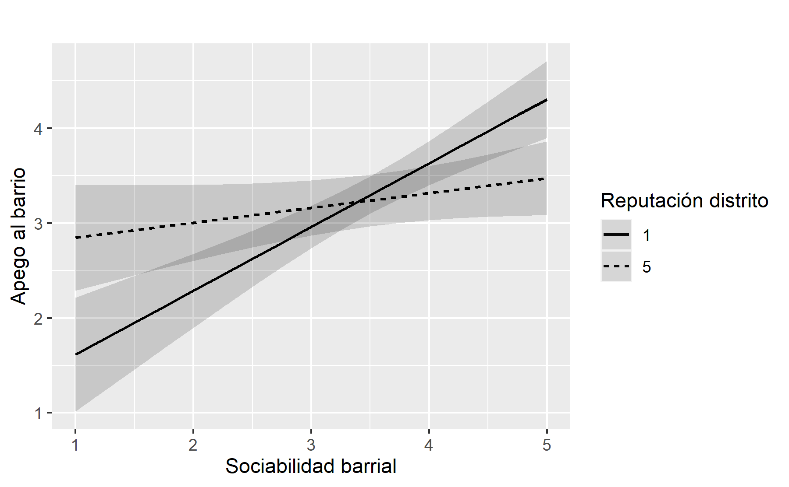
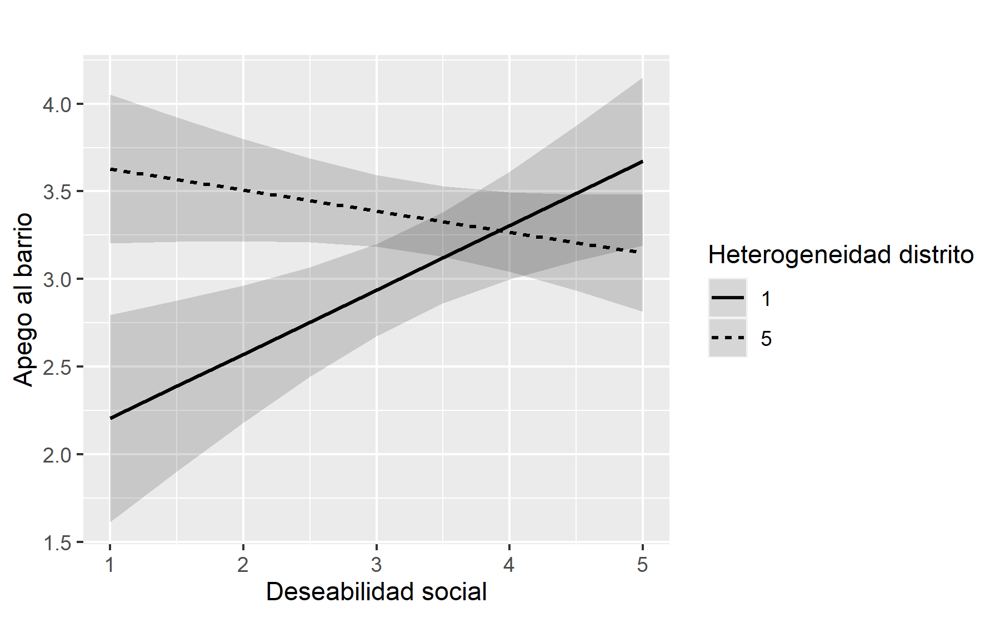

```{r setup, include=FALSE}
options(htmltools.dir.version = FALSE)
knitr::opts_chunk$set(
  fig.width=9, fig.height=3.5, fig.retina=3,
  out.width = "100%",
  cache = FALSE,
  echo = TRUE,
  message = FALSE, 
  warning = FALSE,
  hiline = TRUE
)
names(xaringan:::list_css())
```

```{r librerias-dataset, include=FALSE}
load("../1_input/data/procesada/elsoc.RData")
library(tidyverse)
library(broom)
library(texreg)
```

class: middle

# Contenidos de la presentación: dos momentos

.pull-left[
## <ins>Sintetizar Tesis</ins>

###  I. Estructura de tesis
### II. Propuesta de investigación
### III. Estado del arte e hipótesis
### IV. Abordaje metodológico
### V. Principales resultados
### VI. Conclusiones y Discusión
]

--

.pull-right[
## <ins>Abordar comentarios</ins>

### A. Comentarios profesor guía
### B. Comentarios profesor lector
### C. Conversación con comisión
]

---

class: inverse, center, middle

# I. Estructura de la Tesis

---
# Estructura de la Tesis

## Dos capítulos en formato "artículo empírico" (IMRD)

--

### Capítulo I: Determinantes del Apego Barrial en el AMS de Chile: de la Segregación Residencial a la Experiencia Urbana Situada.

--

  - *¿Cómo surge el apego barrial?*
  
--

### Capítulo II: El Efecto del Entorno Territorial sobre el Apego Barrial: Evidencia Cuantitativa para Evaluar la Influencia del Espacio Urbano en el AMS de Chile.

--

  - *¿En qué condiciones emerge el apego barrial*

---

class: inverse, center, middle

# II. Propuesta de investigación

---

## Problema de investigación

--

### A. AMS ciudad fragmentada y desigual:

--

  -  Problemas de cohesión social a escala barrio.
    - problemas de apego al barrio: vínculo afectivo entre persona y lugar residencial (Scannel & Gifford, 2010)

--

### B. Hipótesis principal (ecológica): 

--

#### Segregación residencial a gran escala desencadena mecanismos que pueden causar _desintegración social_ y _desapego territorial_  (Sabatini et al. 2001; 2010).

--

  > Esfera política: detras de políticas públicas de mixtura socio-espacial.

--

  > Esfera científica: cohesión depende en último término de dinámicas socio-espaciales mayores (**efecto barrio**).

--
  
### ¿Por qué esta explicación del apego resulta insuficiente?
  
---

class: middle right inverse
background-image: url('../defensa-tesis/gse-ams.png')
background-size: 450px
background-position: 10% 50%

--

### Segregación clase baja ~ (-) k social ~ (-) apego

--

### Segregación clase alta ~ (+) k social ~ (+) apego

--

### PERO, hipótesis ecológica... 

--

#### ... oculta mecanismos explicativos que generan <br> los problemas sociales (Ruiz-Tagle & López, 2014)

--

#### ... ignora la vivencia y significación del espacio urbano <br> (Jirón et al. 2010)

--

### **¿Siempre ocurre así?** 

--

### **¿Cómo surge el apego al barrio?**

---

class: inverse, center, middle

## III. Estado del arte e hipótesis

---

## Antecedentes empíricos (i): ¿cómo surge el apego?

####  1. Abordajes parcelados/indirectos

--

- socio-demográficas ~ apego (Comstock et al., 2010; Angelcos & Méndez, 2017)
- socio-relacionales ~ apego (Luneke, 2016; COES., 2017)
- físico-espaciales ~ apego (Greene et al., 2014; Angelcos & Méndez, 2016)
- simbólico-valóricas ~ apego (Elorza, 2019; Rasse & Lin, 2020)

--

#### 2. Abordajes sistemáticos/directos

--

- minoritarios, se basan en la _**satisfacción residencial**_ (Ramkissoon y Mavondo, 2015; Mao et al., 2015). 
  - (+) satisfacción residencial $\to$ (+) apego barrial
  - el apego es explicado por **evaluaciones** del lugar residencial.

--

#### 3. Problemas de los abordajes

--

- Parcelados **no explican el apego**, a lo sumo correlacionan sin controlar efectos.
- Indirectos tratan el apego como **epifenómeno**.
- Sistemáticos **desconocen dimensiones** relevantes (e.g. simbólica).
- La mayoría de las veces no **comparan hipótesis rivales**.

---

## Antecedentes empíricos (ii): ¿bajo qué condiciones surge el apego?

####  1. Hipótesis principal:

--

- Segregación residencial $\to$ apego barrial (Sabatini et al. 2001; 2010)
  - Segregación residencial $\to$ k social/sociabilidad ~ apego barrial 

--

#### 2. Complementos a la hipótesis pricipal: 

--

- Densidad poblacional $\to$ apego barrial (Méndez et al., 2017; Señoret & Link, 2019)
  - Densidad poblacional $\to$ sociabilidad ~ apego barrial
- Accesibilidad urbana $\to$ apego barrial (Sabatini y Wormald, 2013)
- Estigma territorial $\to$ apego barrial (Wacquant et al., 2014)
  - Estigma territorial $\to$ sociabilidad/división interna ~ apego barrial

--

#### 3. Problemas

--

- Oculta **mecanismos explicativos** que generan los problemas sociales (Ruiz-Tagle & López, 2014)
- Ignora la **vivencia y significación** del espacio urbano (Jirón et al. 2010)
- No evalúa ni mide el **rol del espacio**, lo da por sentado (Galster, 2012)

---

## Antecedentes conceptuales: 

1. **Apego al barrio**: _vínculo afectivo entre persona y lugar residencial_ (Scannel & Gifford, 2010)

  > nivel de pertenencia que la persona siente hacia el barrio (Bonaiuto, 2004; Schieffer & Van der Noll, 2016)

--

2. **Experiencia de habitar**: _vivencia significativa del territorio_ (Campos & Ojeda, 2020)
  > evaluación del lugar residencial en cuanto a su capacidad de brindar un buen vivir (Campos & Yávar, 2004)

--

  - dimensión social: pautas de interacción social situadas en el barrio.
  - dimensión física:  localización accesible del barrio a bienes y servicios.
  - dimensión simbólica: distinciones conceptuales que categorizan al barrio.
  
--
  
3. **Entorno territorial**: _condiciones socio-espaciales que operan en una escala geográfica_ (Mascareño & Buscher, 2012)
  > atributo observado en una agregación ecológica (se subdivide en dimensión social, física y simbólica)

--

### <center> _Habitar_ _&_ _entorno_ como conceptos amplios que permiten agrupar determinantes del apego <br> y a la vez distinguirlos en función de las dimensiones del lugar/territorio. <center>


---

# Hipótesis

.center[]

--

> **H1 y H2 indican efectos directos positivos -> (+) $X_i$ $\to$ (+) $Y_i$ / (+) $Z_i$ $\to$ (+) $Y_i$**

> **H3 indica efecto moderador -> (+) $Z_i$ $\to$ (+) $X_i$ ~ $Y_i$**

---

class: inverse, center, middle

# IV. Método


---

# Datos y muestra

.pull-left[
- Nivel micro (actitudes, creencias y percepciones): datos trasversales de la primera ola de la encuesta ELSOC, correspondiente a una medición realizada el 2016.
- Nivel macro (atributos territoriales): datos transversales de CIT a escala zona (186) y distrito (168).
]

--
.pull-right[
- Muestra ELSOC es probabilística, estratificada y por conglomerados, incluye un total de 2927 casos representativos a nivel nacional -> **Representativa para el AMS**
- Seleccionamos 720 casos pertenecientes al AMS, ya que las unidades de análisis y observación son habitantes urbanos de nacionalidad chilena, residentes del AMS, de entre 18 y 75 años
]

---

# Variables

```{r echo=FALSE}
DT::datatable(openxlsx::read.xlsx("../variables.xlsx", sheet = 8), class = "hover",
              options = list(pageLength = 9))
```

---

# Procedimiento analítico capítulo 1:

### A. Regresión lineal múltiple (LRM)

--

> (1) ${\rm ApB}_i={\beta_0+\beta_{1i}*Dem}_{1i}+\ \varepsilon_i$

--

> (2) ${\rm ApB}_i={\beta_0+\beta_{1i}*Dem}_{1i}+\ \beta_{2i}*{\ ExpSoc}_{2i}+ εi$

--

> (3) ${\rm ApB}_i={\beta_0+\beta_{1i}*Dem}_{1i}+\ \beta_{2i}*{\ ExpSoc}_{2i}+\ {\beta_{3i}*ExpFis}_{3i}\ +\varepsilon_i$

--

> (4) ${\rm ApB}_i={\beta_0+\beta_{1i}*Dem}_{1i}+\ \beta_{2i}*{\ ExpSoc}_{2i}+\ {\beta_{3i}*ExpFis}_{3i}+\ {\beta_{4i}*ExpSim}_{4i}\ +\varepsilon_i$

--

- **RLM permite control estadístico del efecto de los factores explicativos**

--

### B. Inferencia multi-modelo (MMI)

--

  - Paso 1:  iterar diferentes combinaciones del modelo que mejor ajusta
  
--

  - Paso 2: rankear modelos iterados por criterio de información Akaike corregio (AICc) -> **busca parsimonia sin sacrificar poder explicativo**

---

# Procedimiento analítico capítulo 2:

### A. Modelo lineal jerárquico (HLM)

--

> (1) $Y_{ij}={\gamma_{00}+\mu_{0j}}+\ r_i$

--

> (2) $Y_{ij}=\gamma_{00}+\gamma_{i0}X_{ij}+\mu_{0j}+r_{ij}$

--

> (3) $Y_{ij}=\gamma_{00}+\gamma_{0i}Z_{ij}+\mu_{0j}+r_{ij}$

--

> (4) $Y_{ij}=\gamma_{00}+\gamma_{i0}X_{ij}+\gamma_{0i}Z_{ij}+\mu_{0j}+r_{ij}$

--

### B. Modelo de interacción entre niveles (CLIM)

> $Y_{ij}=\gamma_{00}+\gamma_{i0}X_{ij}+\gamma_{0i}Z_j+\gamma_{ij}X_{ij}Z_j+\mu_{0j}+\mu_{1j}X_{ij}+r_{ij}$

--

#### Donde $X_{ij}$ son factores de nivel micro-social anidados en el entorno j. Además, $Z_{ij}$ son factores de nivel macro-social del entorno territorial j.

---

class: inverse, center, middle

# V. Resultados

---

# Resultados capítulo 1 (i): comparación modelos (LRM)

```{css, echo = F}
table {
  font-size: 14px;     
}
```

```{r echo = FALSE}
DT::datatable(openxlsx::read.xlsx("../3_output/tablas/cap1/tablas_cap1.xlsx", sheet = 3), 
              colnames = c('Dimensión', 'Variable', 'Modelo 1', 'Modelo 2', 'Modelo 3', 'Modelo 4'),
              class = "hover",
              options = list(pageLength = 9))
```

---

# Resultados capítulo 1 (ii): modelo parsimonioso (MMI)

```{r echo=FALSE}
tidy(lm(apbi ~ time + soci + cnfi + segu + acci + geni + repb + desi, data = elsoc), conf.int = TRUE) %>%
  subset(term != "(Intercept)") %>% 
  ggplot(aes(x = factor(term, level = c('desi','repbPositiva','repbNeutra','geni',
                                          'acci','seguAlta','seguMedia','cnfi','soci','time')),
             y = estimate, ymin = conf.low, ymax = conf.high)) +
  scale_x_discrete(labels=c("time" = "Tiempo de residencia", 
                              "soci" = "Sociabilidad barrial", "cnfi" = "Confianza en Vecinos",
                              "seguMedia" = "Seguridad barrial\n(Media)", 
                              "seguAlta" = "Seguridad barrial\n(Alta)", 
                              "acci" = "Accesibilidad barrial",
                              "geni" = "Encarecimiento barrial", "repbNeutra" = "Reputación barrial\n(Neutra)", 
                              "repbPositiva" = "Reputación barrial\n(Positiva)","desi" = "Deseabilidad social")) +
  geom_hline(yintercept = 0, color = 'red' ) + 
  geom_linerange() + 
  geom_point() + 
  ylab(label = "Tamaño de efecto sobre el apego barrial") +
  xlab(label = NULL) +
  coord_flip() +
  theme_minimal()
```

--


---

#  Resultados capítulo 1 (iii): síntesis

--

1. **Modelo parsimonioso** explica en buena medida la varianza del apego barrial -> $R^2ajustado = 0.48$ 

--

2. No es posible descartar ninguna dimensión de la experiencia de habitar, pero **factores sociales** tienen mayor capacidad explicativa que físicos y simbólicos. 

--

  - Los mejores factores explicativos del apego barrial son: **sociabilidad barrial** $\beta_{21} = 0.37$, **accesibilidad barrial** $\beta_{31} = 0.24$, y la **reputación positiva** del barrio $\beta_{41} = 0.30$; en la dimensiones _social_ , _física_ y _simbólica_ de la experiencia de habitar respectivamente.
  
--

  - La **dimensión simbólica del habitar** es relevante para explicar el apego, aún cuando ha sido poco considerada por la literatura.

--

3. No es posible descartar el **tiempo de residencia** $\beta_{16} = 0.17$, lo cual implica que el apego es un sentimiento desarrollado en el largo plazo. 

--

  - El tiempo de residencia no explica por sí solo la variabilidad del apego barrial, por lo cual el **apego no es un proceso espontaneo, sino susceptible de intervenir** en términos de mejorar la experiencia de habitar. 
  
--

### <center> H1: (+) experiencia de habitar $\to$ (+) apego al barrio <center>

---

#  Resultados capítulo 2 (i): entorno $\to$ apego

--

1. Apego es afectado por el entorno territorial

 - El 14.3% de la variabilidad del apego se explica por las diferencias entre los entornos territoriales a escala zona. En cambio, este resultado baja a 11.8% en el caso de la escala distrito.  

--

2. Los entornos territoriales de ***mixtura social***, con ***alta accesibilidad*** y ***prestigiosos*** afectan positivamente el apego.

--

3.	A medida que el entorno territorial se vuelve más densamente poblado, el apego puede verse perjudicado. Este efecto negativo es mayor en zonas que en distritos. 

--

4.	La escala de agregación geográfica es importante al momento de medir el tamaño de efecto de las variables territoriales sobre el apego. 

--

### <center> H2: (+) entorno territorial $\to$ (+) apego al barrio <center>

---

#  Resultados capítulo 2 (ii): entorno $\to$ experiencia ~ apego

.pull-left[

]

--

.pull-right[

]

--

- Los entornos con mayor reputación y heterogeneidad social pueden asegurar altos niveles de apego al barrio, aún en ausencia de factores experienciales relevantes como la sociabilidad barrial y la deseabilidad social. 

--

- La sociabilidad se vuelve irrelevante para explicar el apego en entornos con prestigio, en cambio, mejora su capacidad explicativa en entornos estigmatizados. Ocurre lo mismo con la relación deseabilidad~apego.

--

### <center> H3: (+) entorno territorial $\to$ (-) experiencia habitar ~ apego al barrio <center>

---

class: inverse, center, middle

# VI. Discusión

---

# Discusión

--

### 1. apego al barrio es un sentimiento multi-causal, no espontaneo y susceptible de intervención.

--

  - apego **no depende ni exclusiva ni principalmente de características socio-demográficas** del habitante.

--

  - como indica la literatura, la dimensión social y física importa, pero también la **simbólica** para explicar el apego.

--

### 2. apego al barrio es fruto, no de atributos del barrio en sí, sino de la experiencia de habitarlo.

--

  - personas pueden significar un mismo atributo de diferente manera, por lo tanto es **necesario incorporar la perspectiva del habitante para estudiar e intervenir lugares**.

--

### 3. entorno territorial todavía puede jugar un rol moderador relevante

--

  - en entornos "integrados" puede **asegurar apego barrial**.

--

  - entornos desiguales dan pie a **mecanismos de cohesión barrial diferentes**.

---

class: inverse, center, middle

# Abordaje comentarios

---

# A. Comentarios profesor guía:

### 1. Consistencia de la crítica a la segregación (hipótesis ecológica)

--

- Capítulo 1: crítica implícita
- Capítulo 2: crítica explícita

--

### 2. No definición de "Entorno territorial"

- Esfuerzo por no definir espacio a priori
- Responder a la pregunta ¿a qué escala el entorno afecta?

---

# B. Comentarios profesor lector (i):

#### 1. Marco conceptual muy amplio que resta foco, relevancia y aporte.

--

#### 2. Novedad de la hipótesis (+) experiencia habitar ~ (+) apego al barrio

--

#### 3. ¿Por qué separar capítulos?

--

#### 4. ¿Cuál es la relevancia sociológica de la relación experiencia ~ apego?

--

#### 5. ¿Cohesión barrial es el apego barrial?  

--

#### 6. Definición poco clara del objeto de estudio y su relación con los determinantes

--

#### 7. Problema de límites entre conceptos y endogeneidad

--

#### 8. Perspectiva inferencia multi-modelo es problemática

--

#### 9. Ajustes al modelo multinivel (pendientes aleatorias y centrado)


---

# B. Comentarios profesor lector (ii):

```{r echo=FALSE}
DT::datatable(openxlsx::read.xlsx("tab-corr.xlsx", sheet = 1), class = "hover",
              options = list(pageLength = 9))
```

---

class: inverse, center, middle

# Gracias por su atención!
## Conversemos 😄
**cristobal.ortiz.v@ug.uchile.cl 📧**

