```{r setup_theme, include = FALSE}

library(xaringanthemer)
style_duo(
  primary_color = "white",
  secondary_color = "#2F4F4F",
  text_color = "#2F4F4F",
#  base_color = '#1068E9',
#  background_color = 'white',
  background_position = 'center',
  header_font_google = google_font("Lato"),
  text_font_google   = google_font("Lato", "300", "300i"),
  code_font_google   = google_font("Droid Mono"),
  code_font_size = '60%',
  #padding= "1em 4em 1em 4em",
  padding = "0.4em 2.4em 0.4em 2.4em",
  extra_fonts = list(google_font("Lato")),
  extra_css = 
  list(
  ".red"   = list(color = "red"),
  ".small" = list("font-size" = "90%"),
  ".pull_l_70" = list("float" = "left","width" = "72%", "font-size" = "90%"),
  ".pull_r_30" = list("float" = "right","width" = "23%"),
  ".pull_left"  = list("float" = "left","width" = "47%", "height" = "100%", "padding-right" = "2%"),
  ".pull_right" = list("float" = "right","width" = "47%", "height" = "100%", "padding-left" = "2%"),
  ".small_left"  = list("float" = "left", "width" = "47%", "height" = "50%", "padding-right" = "2%"),
  ".small_right" = list("float" = "right","width" = "47%", "height" = "50%", "padding-left"  = "2%"),
  ".left_code" = list("float" = "left",  "width" = "47%", "height" = "100%", "padding-right" = "2%",
    "font" = "Hack"),
  ".code_out"  = list("float" = "right", "width" = "47%", "height" = "100%", "padding-left"  = "2%",
    "font" = "Hack"),
  ".text_180" = list("font-size" = "180%"),
  ".text_170" = list("font-size" = "170%"),
  ".text_160" = list("font-size" = "160%"),    
  ".text_150" = list("font-size" = "150%"),
  ".text_140" = list("font-size" = "140%"),  
  ".text_130" = list("font-size" = "130%"),
  ".text_120" = list("font-size" = "120%"),
  ".text_110" = list("font-size" = "110%"),
  ".text_110" = list("font-size" = "110%"),
  ".text_100" = list("font-size" = "100%"),
  ".text_90" = list("font-size" = "90%"),
  ".text_80" = list("font-size" = "80%"),
  ".text_70" = list("font-size" = "70%"),
  ".text_60" = list("font-size" = "60%"),
  ".text_50" = list("font-size" = "50%"),
  ".text_40" = list("font-size" = "40%"),
  ".text_30" = list("font-size" = "30%"),
  ".text_20" = list("font-size" = "20%"),
  ".line_space_11" = list("line-height" = "1.1em;"),
  ".line_space_09" = list("line-height" = "0.9em;"),
  ".line_space_07" = list("line-height" = "0.7em;"),
  ".line_space_05" = list("line-height" = "0.5em;"),
    ".tiny_text" = list(
      "font-family" = "Lato", 
      "font-size"= "70%"
      ),
    ".large_text" = list(
      "font-family" = "Lato", 
      "font-size"= "150%"
      ),
    ".slide_blue" = list(
      "background-color" = "#2F4F4F",
      "color" = "white"
      ),
  ".center_image" = list(
    margin  = "0",
    position = "absolute",
    top      = "50%",
    left     = "50%",
    '-ms-transform' = "translate(-50%, -50%)",
    transform = "translate(-50%, -50%)"
    )
  )
)


knitr::opts_chunk$set(comment = NA)
knitr::opts_chunk$set(dpi=2500)

knitr::opts_chunk$set(
	error = TRUE,
	message = FALSE,
	warning = FALSE,
	echo= TRUE
)
```

class: title-slide, inverse, middle, center

```{r echo=FALSE, out.width = '2%', out.height = '2%'}
knitr::include_graphics('./img/blank_space.png')
```

.line_space_07[
## ¿Cómo se relaciona la desigualdad socioespacial y la 
## cohesión barrial?: el rol mediador de los mecanismos
## subjetivos en los grupos socioeconómicos del AMS
]
<br>

.line_space_05[
.text_100[Cristóbal Ortiz, Mg(c). PUC] 

.text_100[Asistente de investigación COES] 

<br>

.text_100[Quentin Ramond, PhD. SciPo] 

.text_100[Investigador adjunto COES] 

<br>
]

<br>

```{r echo=FALSE, out.width = '20%'}
knitr::include_graphics('./img/blank_space.png')

knitr::include_graphics('./img/blank_space.png')

knitr::include_graphics('./img/blank_space.png')
```

---

class: middle

# Contenidos de la presentación: 

###  I. Problema de investigación
### II. Discusión teórica
### III. Método
### IV. Resultados preliminares
### V. Conclusión y discusión

---

class: inverse, center, middle

# I. Problema de investigación

---

## Problema de investigación

--

### A. Gran Santiago como ciudad segregada y diversa:

--

  -  Cohesión social se ha vuelto una preocupación pública (Consejo de Cohesión Social, 2020)
    - Cohesión barrial como escala geográfica abordable (incluso desde antes del Consejo)
--

### B. Principales tesis para el caso chileno (Gran Santiago): 

--

- Deterioro de la cohesión barrial se debe a "efectos de barrio" en tres sentidos:

--

  - (1) Segregación de la vivienda social (familiar empobrecidas) en periferias excluidas geneneró una serie de dinámicas que terminaron por debilitar la "noción de barrio" (Sabatini et al., 2013). 

--

  - (2) Verticalización del centro y pericentro causan reconfiguraciones espaciales que dificultan prácticas de cohesión (Link, et al. 2021; Orellana, et al. 2022).

--

  - (3) Desigualdades socioespaciales favorecen "acumulación" de la cohesión barrial (Méndez, et al. 2020).

--

#### Pregunta por la relación entre la desigualdad socioespacial y las formas de cohesión barrial

---

class: inverse, center, middle

## II. Discusión teórica

---
## A. Estado del arte: conceptos

**Concepto de cohesión social**

  - Definición analítica (no normativa) y multidimensional: “atributo descriptivo de un colectivo, que indica la calidad de la unión colectiva” Y que se caracteriza en lo esencial por tres componentes “*una fuerte conexión emocional con la entidad social*, *estrechas relaciones sociales*, y una *fuerte orientación hacia el bien común*” (Schieffer & van der Noll, 2017) 

--

**Concepto de cohesión barrial**

  - Estado de la convivencia del colectivo residencial, visible en la interrelación de actitudes y prácticas en torno a: el *apego al barrio*, las *relaciones de vecindad* y el *compromiso cívico local* (Méndez et al., 2020). En suma 3 dimensiones:
    - **Afectiva: apego barrial**
    - Relacional: relaciones vecinal
    - Práctica: compromiso cívico local

- Cada dimensión representa una forma diferente de cohesión, así como distintas funciones de lo que se considera un barrio en un mundo globalizado (Forrest, 2008). 

---
## A. Estado del arte: teoría

--

1. **Hipótesis del contacto  y efecto de barrio (efecto de la segregación)**

  - a favor "heterofilia": (+) mixtura social (↓ segregación) $\to$ (+) cohesión (Sabatini et al. 2013)
  - en contra "homofilia": (+) mixtura social (↓ segregación) $\to$ (-) cohesión (Putnam, 2007)
  - salvedades: (+) segregación $\to$ (+-) cohesión; depende de la acumulación y prestigio (Méndez et al. 2020)

--

2. **Mecanismos subjetivos (efecto de experiencias de malestar)**

  - reputación territorial: (-) reputación $\to$ (-) cohesión (Wacquant et al., 2014; (Alvarez & Ruiz-Tagle, 2022)
  - sentimiento de seguridad: (-) seguridad $\to$ cohesión (Dammert, 2004; Luneke, 2016)
  - satisfacción residencial: (+) satisfacción $\to$ (+) cohesión (Ramkissoon & Mavondo, 2015)

---

## B. Vacíos investigativos

--

2. **Predominio de explicaciones estructurales infravaloran el rol de los mecanismos subjetivos**

  - Ignora la **vivencia y significación** del espacio urbano, la **experiencia** de habitar el barrio
  - Una cosa es que en barrios segregados existan problemas, otra es que la segregación efectivamente contribuya a causarlos.
  
---

## C. Pregunta: 
***¿Cómo ha influido la segregación residencial, a través de diferentes experiencias urbanas, en el apego barrial de los residentes de Santiago de Chile?***

```{r echo=FALSE, out.width = '50%'}
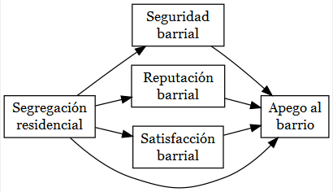
```

---

class: inverse, center, middle

## III. Método

---

## Datos y caso de estudio

  - Muestra ELSOC es probabilística, estratificada y por conglomerados, incluye un total de 2927 casos representativos a nivel nacional -> **Representativa para el AMS**.
  - Unidades de análisis en dos niveles:
    - individual: habitantes urbanos de nacionalidad chilena residentes del AMS de entre 18 y 75 años (720 casos).  
    - barrial: zonas censales del AMS que anidan unidades de análisis individuales (186 casos).

---

## Operacionalización

```{r echo=FALSE, out.width = '100%'}
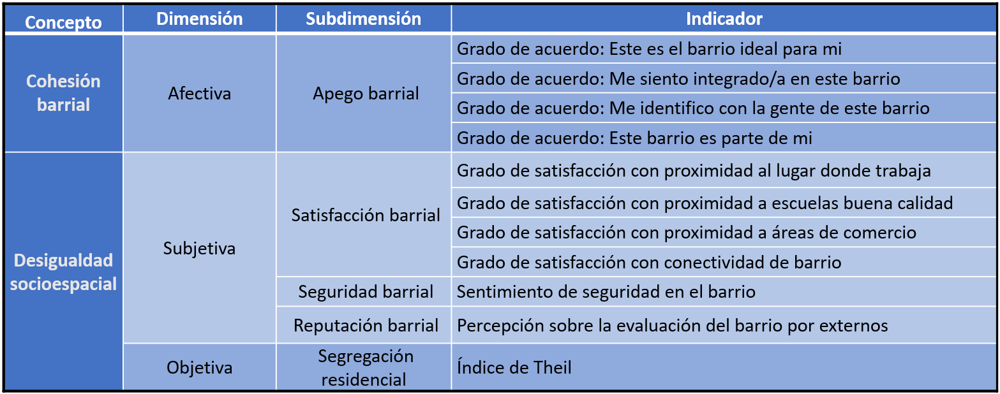
```

---
## Procedimiento analítico

- Modelos de ecuaciones estructurales que incorporan factores subjetivos y objetivos en la explicación del apego barrial
  - Análisis de efectos directos de la segregación 
  - Análisis de efectos de mediación de experiencias (mecanismos subjetivos)
  
- Recordando la pregunta de investigación

***¿Cómo ha influido la segregación residencial, a través de diferentes experiencias urbanas, en el apego barrial de los residentes de Santiago de Chile?***

```{r echo=FALSE, out.width = '50%'}

```

---

class: inverse, center, middle

## IV. Resultados

---

## ¿Qué ha ocurrido con el apego barrial en el AMS?...

```{r echo=FALSE, out.width = '50%'}
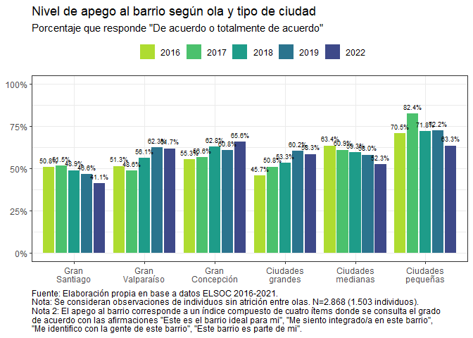
```

---

## ...¿y qué ocurre en cada grupo socioeconómico?

```{r echo=FALSE, out.width = '50%'}
knitr::include_graphics('./img/spb-educ-ams.png')
```

---

## La segregación residencial el Gran Santiago


.pull-left[
```{r echo=FALSE, out.width = '100%'}
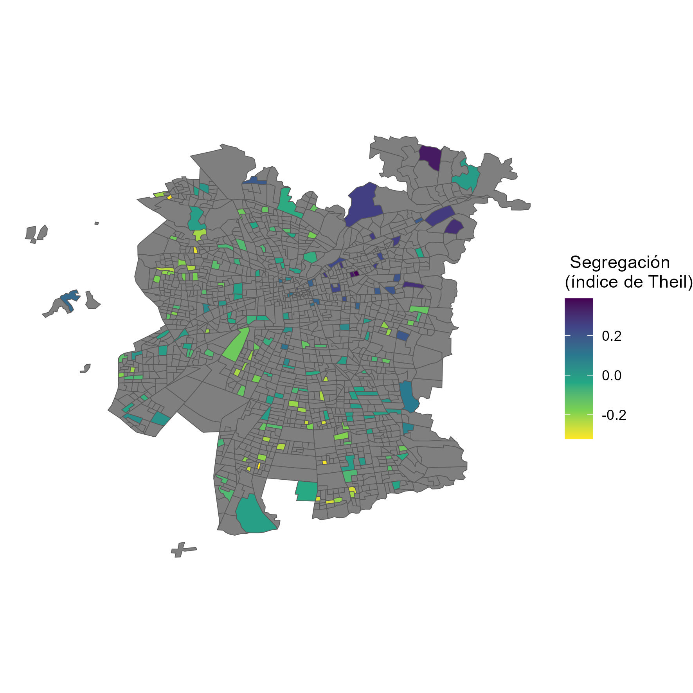
```
  ]
.pull-right[
  ]
  
---

## La segregación residencial el Gran Santiago

.pull-left[
```{r echo=FALSE, out.width = '100%'}
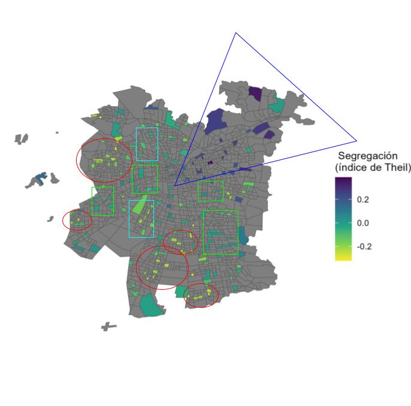
```
  ]

.pull-right[

Patrones de segregación
  - barrios aventajados (triángulo azul)
  - barrios medios-altos (cuadrado verdes)
  - barrios medios bajos (cuadrados celestes)
  - barrios desaventajados (círculos rojos)

  ]

---

## El apego barrial en el Gran Santiago

.pull-left[
```{r echo=FALSE, out.width = '100%'}
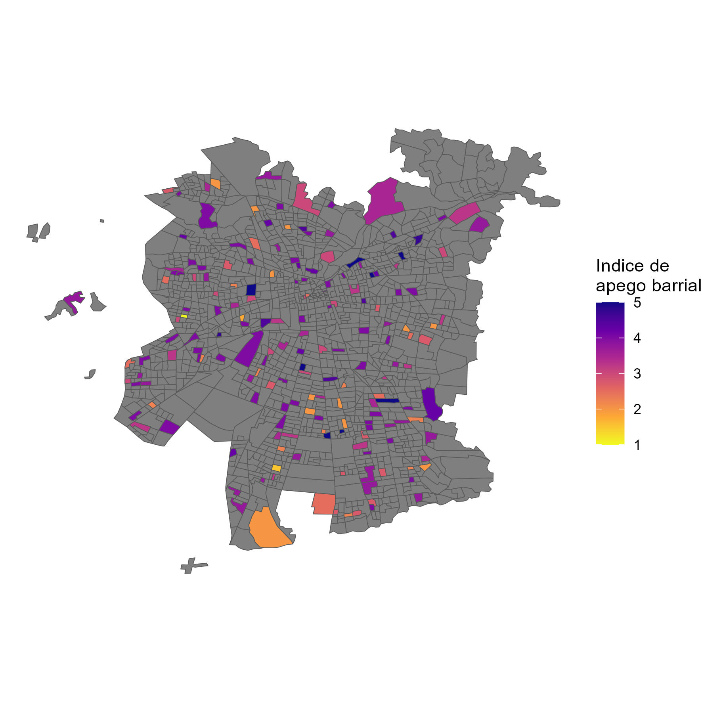
```
  ]
.pull-right[
  ]

---

## El apego barrial en el Gran Santiago

.pull-left[
```{r echo=FALSE, out.width = '100%'}
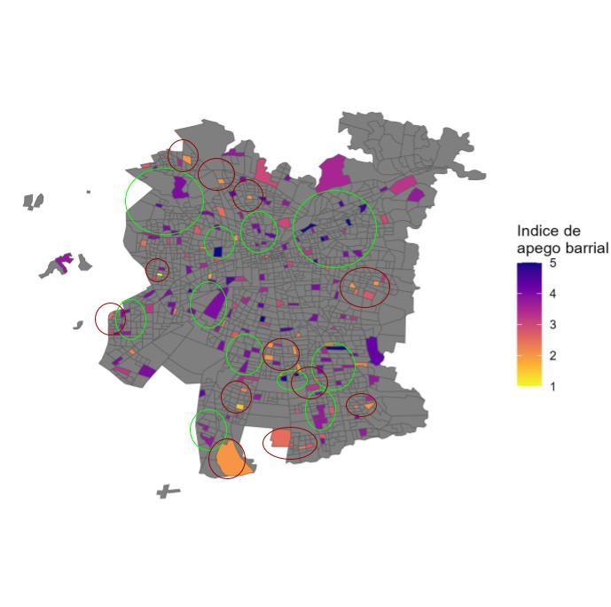
```
  ]

.pull-right[
Patrones de apego
  - alta cohesión (círculos verdes)
  - baja cohesión (círculos rojos)
  ]

---

## Modelo general

.pull-left[
```{r echo=FALSE, out.width = '100%'}
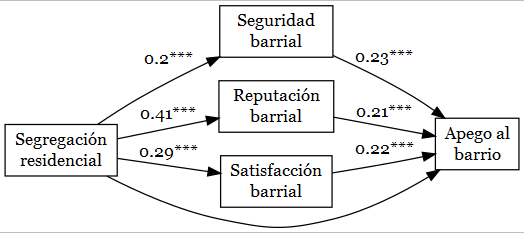
```
  ]

--

.pull-right[
 - El efecto de la segregación residencial sobre el apego barrial ocurre a través de los mecanismos subjetivos. Es decir, la segregación afecta la cohesión, pero sólo debido a que la segregación afectó a algún mecanismo subjetivo en primer lugar
 
 - Efecto mediador es total, es decir, en ausencia de los mecanismos subjetivos, la segregación no explica el apego barrial
 
 - En barrios más favorecidos y homogéneos es mayor el apego barrial, pero debido a que existe un alto nivel de seguridad/reputación/satisfacción barrial
  ]

---

## Modelo para grupos socioeconómicos bajos

.pull-left[
```{r echo=FALSE, out.width = '100%'}
knitr::include_graphics('./img/sem_low.png')
```
  ]
  
--
.pull-right[
 - En los grupos socioeconómicos bajos, el efecto de la segregación residencial sobre el apego barrial también ocurre a través de los mecanismos subjetivos. 
 
 - Efecto mediador es total, es decir, en ausencia de los mecanismos subjetivos, la segregación no explica el apego barrial
  ]

---

## Modelo para grupos socioeconómicos medios bajos

.pull-left[
```{r echo=FALSE, out.width = '100%'}
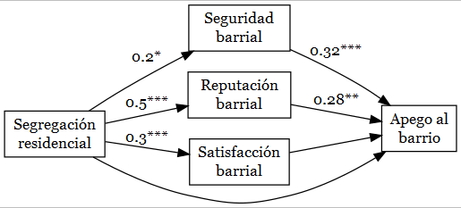
```
  ]
  
--
.pull-right[
 - En los grupos socioeconómicos medios-bajos, el efecto de la segregación residencial sobre el apego barrial ocurre a través de la seguridad y la reputación barrial.
 
 - Estos efectos mediadores son total, es decir, en ausencia de seguridad y reputación, la segregación no explica el apego barrial.
  ]

---

## Modelo para grupos socioeconómicos medios altos

.pull-left[
```{r echo=FALSE, out.width = '100%'}
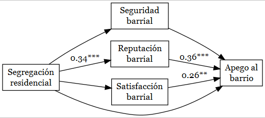
```
  ]
  
--
.pull-right[

 - En los grupos socioeconómicos medios-alto, el efecto de la segregación residencial sobre el apego barrial también ocurre sólo a través de la reputación barrial.
 
 - Este efecto mediador es total, es decir, en ausencia de reputación, la segregación no explica el apego barrial.

  ]

---

## Modelo para grupos socioeconómicos altos

.pull-left[
```{r echo=FALSE, out.width = '100%'}
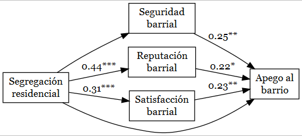
```
  ]
  
--
.pull-right[

 - En los grupos socioeconómicos altos, el efecto de la segregación residencial sobre el apego barrial ocurre a través de la reputación y la satisfacción barrial.
 
 - Este efecto mediador es total, es decir, en ausencia de reputación y satisfacción barrial, la segregación no explica el apego barrial.

  ]

---

class: inverse, center, middle

## V. Conclusión y discusión

---

## Conclusión y discusión

### 1. Segregación residencial NO explica el apego barrial por sí sola
  - La relación entre segregación y apego ocurre sólo a través de mecanismos subjetivos
  - Mecanismos sugeridos por la literatura efectivamente favorecen la cohesión: 
  - (+) seguridad/reputación/satisfacción $\to$ (+) apego barrial
  
--
  
### 2. La segregación residencial se experimenta de forma desigual
  - En grupos bajos predominan todos los mecanismos subjetivos
  - En grupos medios-bajos importa la seguridad y la reputación
  - En grupos medios-altos prevalece sólo la reputación
  - En grupos altos es relevante la reputación y la satisfacción

--

### 3. Las políticas de mixtura deben considerar más la subjetividad del residente

---

class: inverse, center, middle

# Gracias por su atención!
## Conversemos 😄
## cristobalortizvi@gmail.com 📧

---
