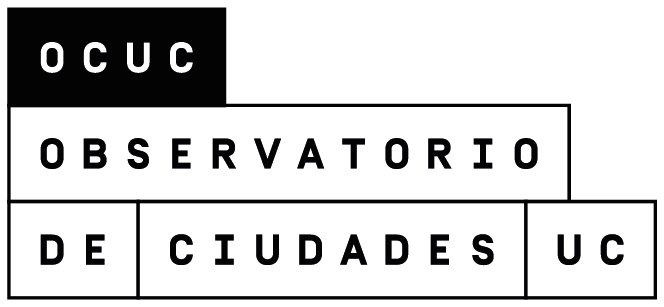
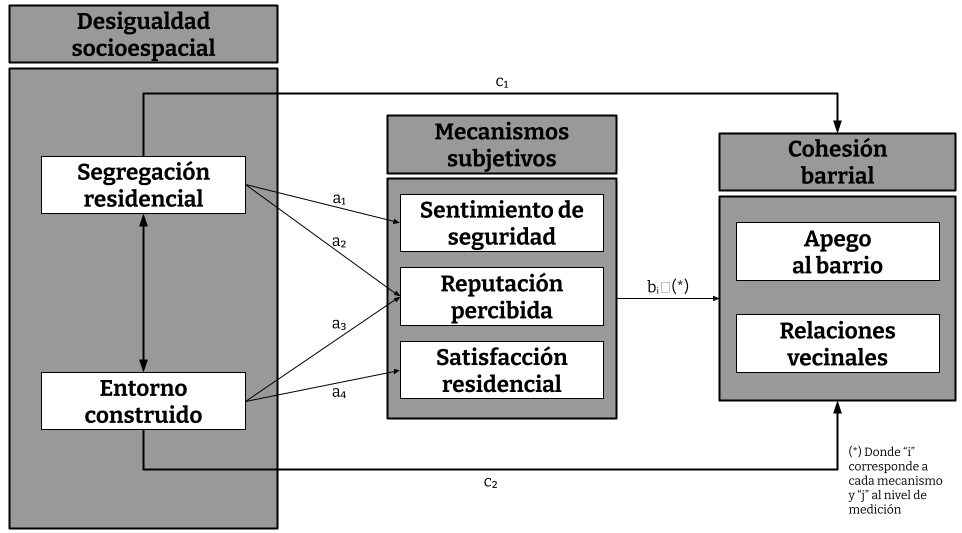
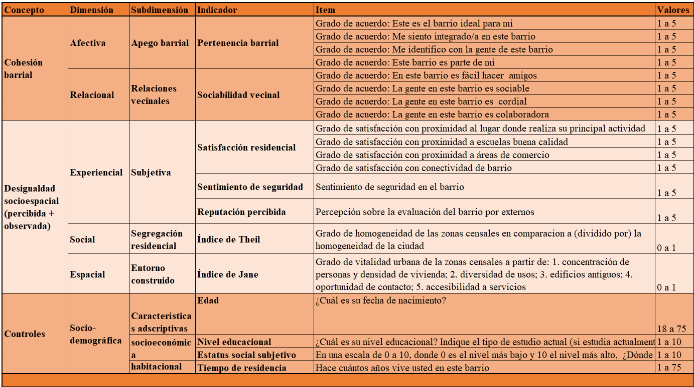
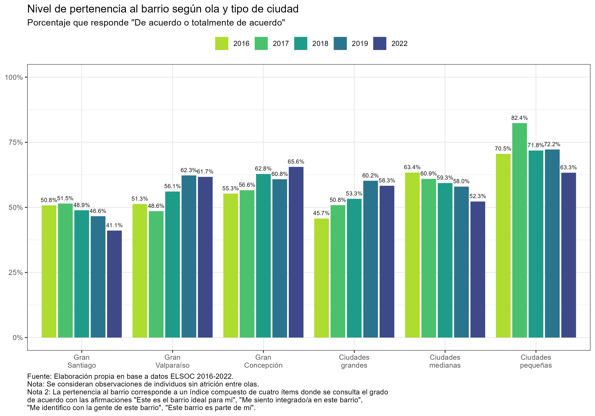
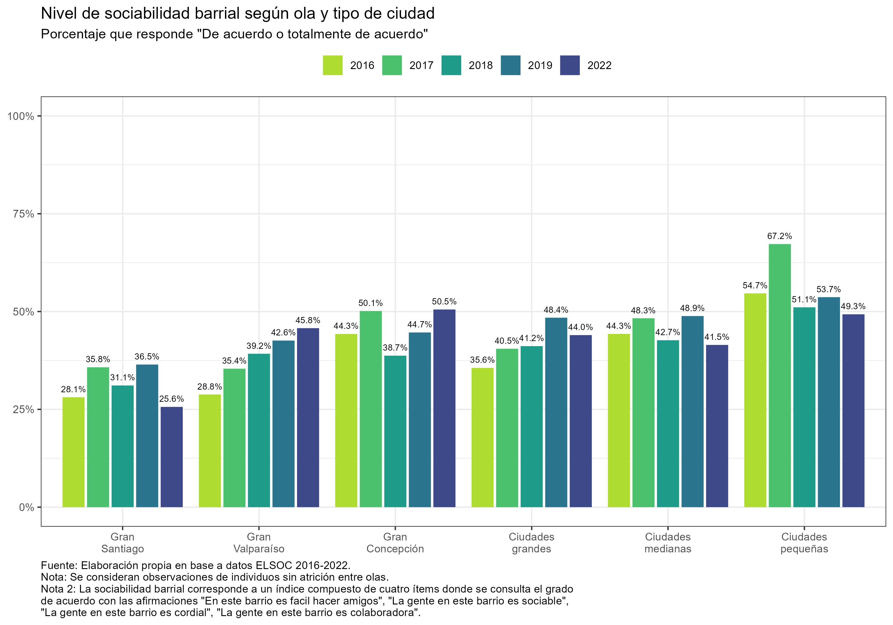
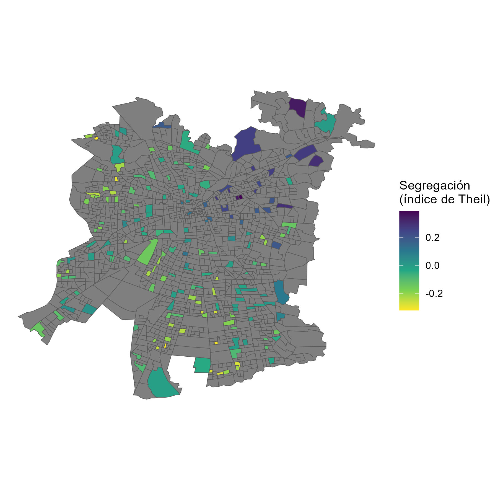
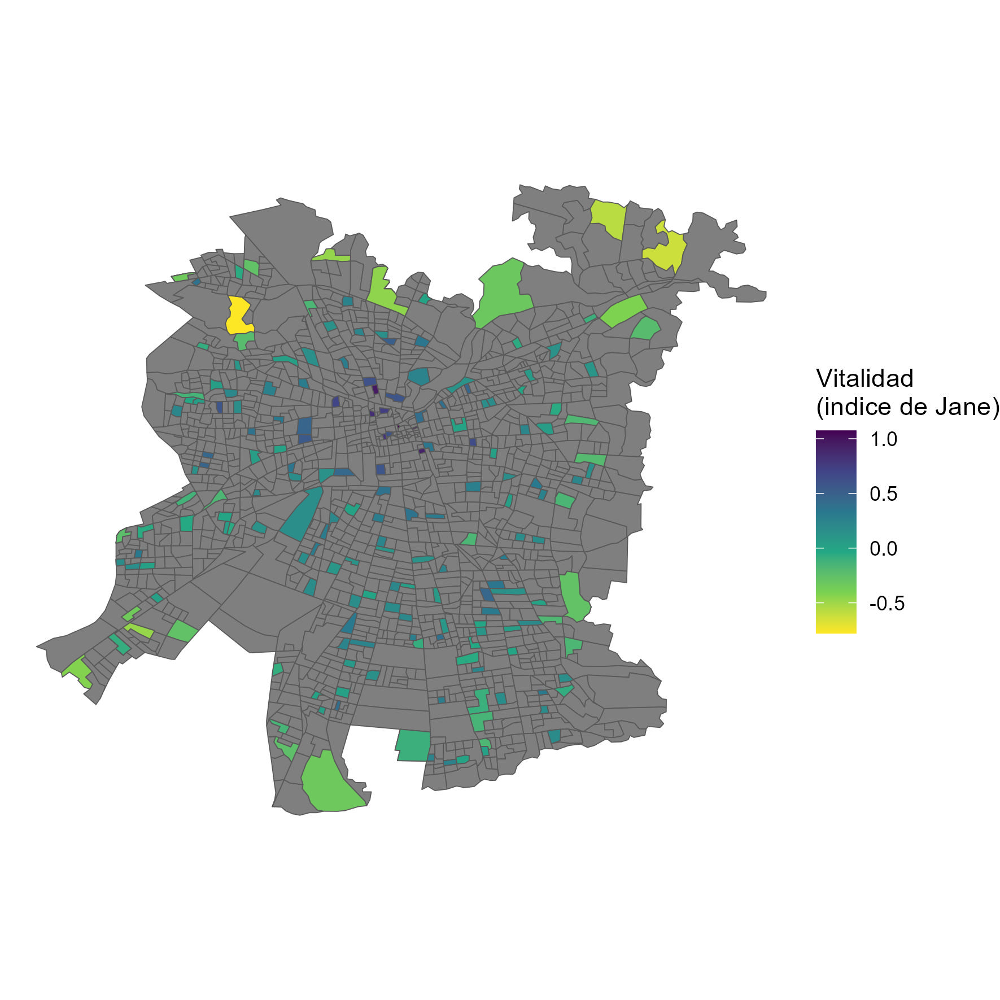
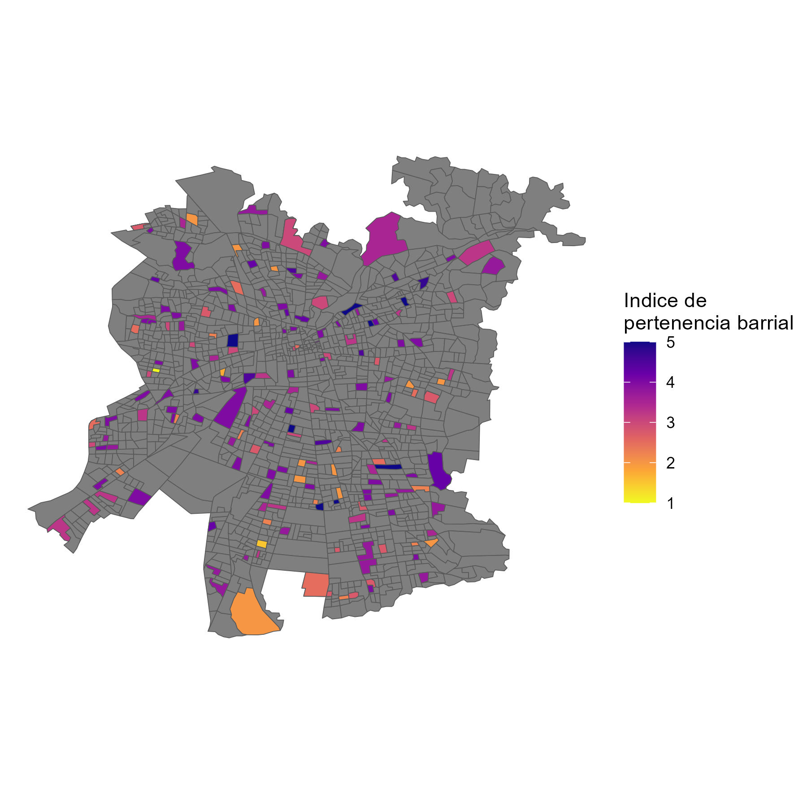
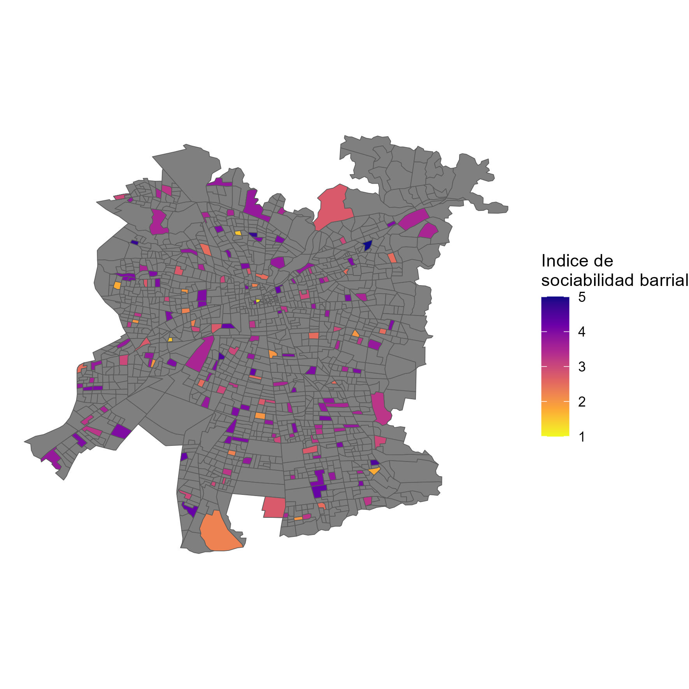

```{r setup_theme, include = FALSE}

library(xaringanthemer)
style_duo(
  primary_color = "white",
  secondary_color = "#2F4F4F",
  text_color = "#2F4F4F",
#  base_color = '#1068E9',
#  background_color = 'white',
  background_position = 'center',
  header_font_google = google_font("Lato"),
  text_font_google   = google_font("Lato", "300", "300i"),
  code_font_google   = google_font("Droid Mono"),
  code_font_size = '60%',
  #padding= "1em 4em 1em 4em",
  padding = "0.4em 2.4em 0.4em 2.4em",
  extra_fonts = list(google_font("Lato")),
  extra_css = 
  list(
  ".red"   = list(color = "red"),
  ".small" = list("font-size" = "90%"),
  ".pull_l_70" = list("float" = "left","width" = "72%", "font-size" = "90%"),
  ".pull_r_30" = list("float" = "right","width" = "23%"),
  ".pull_left"  = list("float" = "left","width" = "47%", "height" = "100%", "padding-right" = "2%"),
  ".pull_right" = list("float" = "right","width" = "47%", "height" = "100%", "padding-left" = "2%"),
  ".small_left"  = list("float" = "left", "width" = "47%", "height" = "50%", "padding-right" = "2%"),
  ".small_right" = list("float" = "right","width" = "47%", "height" = "50%", "padding-left"  = "2%"),
  ".left_code" = list("float" = "left",  "width" = "47%", "height" = "100%", "padding-right" = "2%",
    "font" = "Hack"),
  ".code_out"  = list("float" = "right", "width" = "47%", "height" = "100%", "padding-left"  = "2%",
    "font" = "Hack"),
  ".text_180" = list("font-size" = "180%"),
  ".text_170" = list("font-size" = "170%"),
  ".text_160" = list("font-size" = "160%"),    
  ".text_150" = list("font-size" = "150%"),
  ".text_140" = list("font-size" = "140%"),  
  ".text_130" = list("font-size" = "130%"),
  ".text_120" = list("font-size" = "120%"),
  ".text_110" = list("font-size" = "110%"),
  ".text_110" = list("font-size" = "110%"),
  ".text_100" = list("font-size" = "100%"),
  ".text_90" = list("font-size" = "90%"),
  ".text_80" = list("font-size" = "80%"),
  ".text_70" = list("font-size" = "70%"),
  ".text_60" = list("font-size" = "60%"),
  ".text_50" = list("font-size" = "50%"),
  ".text_40" = list("font-size" = "40%"),
  ".text_30" = list("font-size" = "30%"),
  ".text_20" = list("font-size" = "20%"),
  ".line_space_11" = list("line-height" = "1.1em;"),
  ".line_space_09" = list("line-height" = "0.9em;"),
  ".line_space_07" = list("line-height" = "0.7em;"),
  ".line_space_05" = list("line-height" = "0.5em;"),
    ".tiny_text" = list(
      "font-family" = "Lato", 
      "font-size"= "70%"
      ),
    ".large_text" = list(
      "font-family" = "Lato", 
      "font-size"= "150%"
      ),
    ".slide_blue" = list(
      "background-color" = "#2F4F4F",
      "color" = "white"
      ),
  ".center_image" = list(
    margin  = "0",
    position = "absolute",
    top      = "50%",
    left     = "50%",
    '-ms-transform' = "translate(-50%, -50%)",
    transform = "translate(-50%, -50%)"
    )
  )
)


knitr::opts_chunk$set(comment = NA)
knitr::opts_chunk$set(dpi=2500)

knitr::opts_chunk$set(
	error = TRUE,
	message = FALSE,
	warning = FALSE,
	echo= TRUE
)
```

class: title-slide, inverse, middle, center

```{r echo=FALSE, out.width = '2%', out.height = '2%'}
knitr::include_graphics('./img/blank_space.png')
```

.line_space_07[
### Sobre la intrincada relación entre 
### desigualdad sociospacial y cohesión barrial:
### del *efecto de barrio* al *efecto subjetivado*
### en los GSE del Gran Santiago (2022)
]
<br>

.line_space_05[
.text_100[Cristóbal Ortiz, Mg(c). IEUT-PUC] 

.text_100[Asistente de investigación L4 COES & Tesista OCUC] 

<br>

.text_70[X CONFERENCIA INTERNACIONAL COES]

.text_70[PASADO, PRESENTE Y FUTURO DEL CONFLICTO Y LA COHESIÓN SOCIAL]

]


<br>

```{r echo=FALSE, out.width = '10%'}
knitr::include_graphics('./img/blank_space.png')

knitr::include_graphics('./img/blank_space.png')
knitr::include_graphics('./img/coes-logo.png')
knitr::include_graphics('./img/blank_space.png')

knitr::include_graphics('./img/blank_space.png')
```

---

class: middle

# Contenidos de la presentación: 

###  I. Problema de investigación
### II. Discusión teórica
### III. Método
### IV. Resultados preliminares
### V. Conclusión y discusión

---

class: inverse, center, middle

# I. Problema de investigación

---

## Problema de investigación

--

### A. Gran Santiago como ciudad segregada y desigual:

--

  -  Cohesión social se ha vuelto una preocupación pública (Consejo de Cohesión Social, 2020)
    - Cohesión barrial como escala geográfica abordable (incluso desde antes del Consejo)
--

### B. Principales tesis para el caso chileno (Gran Santiago): 

--

- El estado de la cohesión barrial es causa de los "efectos de barrio" en dos sentidos:

--

  - (1) Segregación de la vivienda social (grupos desfavorecidos) en periferias excluidas generó una serie de dinámicas que terminaron por "debilitar la noción de barrio" (Sabatini et al., 2013). Por su parte, segregación de grupos favorecidos propicia la acumulación de cohesión barrial en tanto "forma de privilegio" (Méndez, et al. 2020).

--

  - (2) Rol del espacio: verticalización del centro y pericentro generan reconfiguraciones espaciales que dificultan prácticas de cohesión (Link, et al. 2021; Orellana, et al. 2022). Por el contrario, hay ciertas configuraciones espaciales (más vitales) que favorecen la cohesión barrial (Jacobs, 1961).

--

#### Gran presencia de la pregunta por la relación entre la desigualdad socioespacial y la cohesión barrial en los últimos 10 años.

---

class: inverse, center, middle

## II. Discusión teórica

---

## A. Estado del arte: conceptos

**Concepto de cohesión social**

  - Definición analítica (no normativa) y multidimensional: “atributo descriptivo de un colectivo, que indica la calidad de la unión colectiva” Y que se caracteriza en lo esencial por tres componentes “*una fuerte conexión emocional con la entidad social*, *estrechas relaciones sociales*, y una *fuerte orientación hacia el bien común*” (Schieffer & van der Noll, 2017).

--

**Concepto de cohesión barrial**

  - Estado de la convivencia del colectivo residencial, visible en la interrelación de actitudes y prácticas en torno a: el *apego al barrio*, las *relaciones de vecindad* y el *compromiso cívico local* (Méndez et al., 2020). En suma 3 dimensiones:
    - **Afectiva: apego barrial (pertenencia)**
    - **Relacional: relaciones vecinales (sociabilidad)**
    - Práctica: compromiso cívico local (participación)

--

**Concepto de desigualdad socioespacial**

  - En línea con PNUD (2017) se define coomo la a distribución diferenciada de los recursos materiales y simbólicos a través del espacio urbano percibidos como injustos. Esta desigualdad implica a la vez esferas diferenciadas de interacción social y acceso diferenciado a recursos,  visible principal, aunque no exclusivamente, en la **segregación residencial** y el **entorno construido** que componen el contexto residencial, así como en la **percepción de estas diferencias**.

---

## A. Estado del arte: teoría

--

1. **Los efectos de barrio (efecto de la composición social/segregación)**

  - a favor: (+) segregación $\to$ (-) cohesión (Sabatini et al. 2013)
  - en contra: (+) segregación $\to$ (+) cohesión (Putnam, 2007)
  - salvedad: (+) segregación $\to$ (+-) cohesión; depende de la reputación (Méndez et al. 2020; Otero et al. 2023)

--

2. **Geografías del encuentro (efecto del espacio/entorno construido)**

  - vitalidad urbana: (+) mixtura de usos $\to$ (+) cohesión "práctica" (Jacobs, 1967)
  - familiaridad pública: (+) espacios públicos $\to$ (+) cohesión "simbólica" (Blokland & Nast, 2014)
  - salvedades: (++) densidad/mixtura usos $\to$ (-) cohesión (Link, et al. 2022)

--


3. **Mecanismos subjetivos (efecto de las percepciones y creencias)**

  - reputación territorial: (-) reputación $\to$ (-) cohesión (Wacquant et al., 2014; Alvarez & Ruiz-Tagle, 2022)
  - sentimiento de seguridad: (-) seguridad $\to$ cohesión (Dammert, 2004; Luneke, 2016)
  - satisfacción residencial: (+) satisfacción $\to$ (+) cohesión (Ramkissoon & Mavondo, 2015, Bonaiuto et al., 2017)

---

## B. Vacíos investigativos

--

1. **Pocas mediciones conjuntas de los determinantes de la cohesión barrial (y sus respectivas formas)**

  - ¿Es más determinante el efecto de la segregación o del entorno?. 
  - ¿Sobre cuál forma de cohesión es más pronunciado este efecto?.

--

2. **Predominio de explicaciones estructurales infravaloran el rol de los mecanismos subjetivos**

  - Ignora la **vivencia y significación** del espacio urbano, es decir, la **experiencia** de habitar el barrio.
  - Una cosa es que en barrios segregados existan problemas, otra es que la segregación efectivamente contribuya a causarlos.

--

3. **Poca evidencia diferenciada para cada GSE**

  - Si cada GSE tiene una subjetividad característica, entonces en cada cual debería prevalecer un mecanismo diferente.

---

## C. Pregunta: 
***¿Cómo influyen los niveles de segregación residencial y las condiciones del entorno construido, a través de las experiencias urbanas en el barrio –en particular el sentimiento de seguridad, la satisfacción residencial y la reputación percibida –, en las formas de cohesión barrial de los residentes del Gran Santiago de Chile en 2022?***

```{r echo=FALSE, out.width = '70%'}

```

---

class: inverse, center, middle

## III. Método

---

## Datos y caso de estudio

  - Muestra ELSOC es probabilística, estratificada y por conglomerados, incluye un total de 2927 casos representativos a nivel nacional -> **Representativa para el AMS**.
  - Unidades de análisis en dos niveles:
    - individual: habitantes urbanos de nacionalidad chilena residentes del AMS de entre 18 y 75 años (720 casos).  
    - barrial: zonas censales del AMS que anidan unidades de análisis individuales (186 casos).

---

## Operacionalización

```{r echo=FALSE, out.width = '80%'}

```

---
## Procedimiento analítico

- Modelos de ecuaciones estructurales que incorporan factores objetivos y subjetivos en la explicación de la cohesión barrial
  - Análisis de efectos directos (DSE $\to$ CB)
  - Análisis de efectos indirectos (DSE ~ MS $\to$ CB)

- Recordando la pregunta de investigación

***¿Cómo ha influido la desigualdad socioespacial, a través de diferentes experiencias urbanas, en la cohesión barrial de los residentes de Santiago de Chile?***

.pull-left[
```{r echo=FALSE, out.width = '100%'}

```
]

.pull-right[
- Mediación ocurre en el nivel 2 (varianza entre barrios). DSE->MS(Intercepto)->CB(Intercepto). Es decir, un efecto de la DSE sobre las medias barriales del MS y CB.
- Supuesto: La DSE afecta a cada barrio en su conjunto (o, dicho de otra manera, DES afecta los MS y la CB de sus residentes debido que habitan dicho barrio y no otro)
]

---

class: inverse, center, middle

## IV. Resultados

---

## La cohesión barrial en Chile y el AMS

```{r echo=FALSE, out.width = '70%'}

```

---

## La cohesión barrial en Chile y el AMS

```{r echo=FALSE, out.width = '70%'}

```

---

## La desigualdad socioespacial en el Gran Santiago


.pull-left[
```{r echo=FALSE, out.width = '100%'}

```
  ]
.pull-right[
```{r echo=FALSE, out.width = '100%'}

```
  ]

---

## La cohesión barrial en el Gran Santiago

.pull-left[
```{r echo=FALSE, out.width = '100%'}

```
  ]
.pull-right[
```{r echo=FALSE, out.width = '100%'}

```
  ]

---

class: middle right
background-image: url('./img/coef_plot.png')
background-size: 650px
background-position: 5% 50%

## Resultados generales

--

Efecto de la **DSE** sobre la **CB** ocurre a través de los **MS**, 

es decir, la **DSE** afecta la **CB**, pero sólo porque la **DSE** 

afectó un **MS** en primer lugar.

--

Efecto mediador es total, es decir, en ausencia de los 

**MS**, la **DSE** no explica la **CB**.

--

Destaca el efecto mediado de la  **segregación** 

sobre el la **pertenencia**, que ocurre a través 

de la **reputación**: (+)SEG~(-)REP $\to$ (-)PB.

--

### Mediación da cuenta de un *efecto subjetivado*

---

class: middle right
background-image: url('./img/coef_plot_gse.png')
background-size: 650px
background-position: 5% 50%


## Resultados por GSE

Al diferenciar por GSE también identificamos efectos 

mediados, sin embargo, son diferentes para cada GSE.

--

Destaca el efecto mediado **(+)SEG~(-)REP $\to$ (-)PB**, 

en especial para los GSE medios y no

en el caso de los extremos.

--

En el caso de la pertenencia, el efecto 

mediador es total, en cambio para la

sociabilidad es parcial.

--

### *Efecto subjetivado* opera más en GSE medios.

---

class: inverse, center, middle

## V. Conclusión y discusión

---

## Conclusión y discusión

#### 1. La DSE expresada en condiciones barriales diferentes NO explica los niveles de CB por sí sola, sino sólo a través de MS que permiten interiorizar estas diferencias. Del *efecto de barrio* al *efecto subjetivado*.
  - La **SEG** y el **ENT** NO tienen efecto directo, sólo **SEG** tiene efecto indirecto mediante **REP**. 
  - **MS** sugeridos por la literatura efectivamente favorecen la cohesión, destacando la **REP**.
  - **SEG** deteriora la **REP**, lo que a su vez disminuye la **CB** ((+)SEG~(-)REP $\to$ (-)PB) 
  
--

#### 2. El *efecto subjetivado* la DSE a través de MS es más fuerte en la formas simbólicas de la cohesión (**pertenencia**) que en su expresión concreta (**sociabilidad**).
 - Al parecer la sociabilidad no dependen tanto de las condiciones barriales.

--

#### 3.  El *efecto subjetivado de la desigualdad socioespacial* sobre la cohesión se experimenta diferenciadamente en función del GSE 
  - Existe efecto directo de la **SEG** sobre la sociabilidad en GSE medio alto ((+)SEG $\to$ (+)SOC).
  - En la mayoría de los GSE prevalecen los **MS**, pero el *efecto subjetivado* (SEG~REP $\to$ PB) es mayor en GSE medios bajos y altos
  - Esto va contra lo que dice la literatura (reputación opera en los extremos). Posible razón: GSE medios (tradicionalmente mixtos), al verse expuestos a **(+)SEG**, experimentan un estigma lo cual deteriora la **CB**.

--

#### 4. Las políticas de mixtura y regeneración urbana deben considerar más la subjetividad del residente, la que no sólo es variable, sino que va más allá de las condiciones barriales.

---

class: inverse, center, middle

# Gracias por su atención!
## Conversemos 😄
## cristobalortizvi@gmail.com 📧
