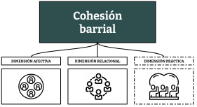
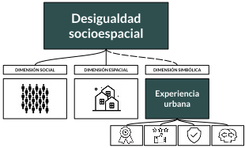
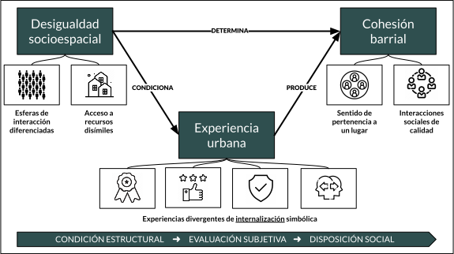
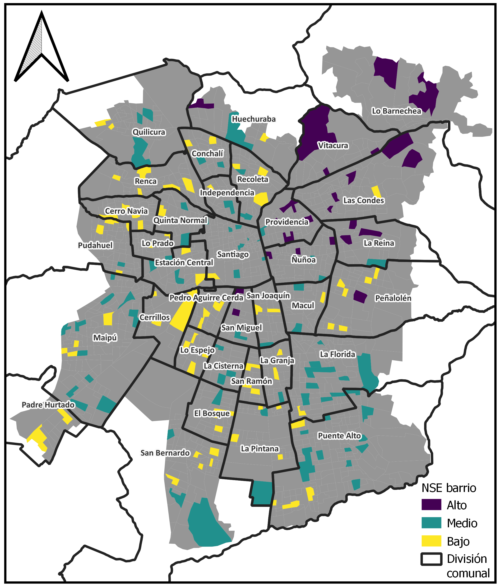
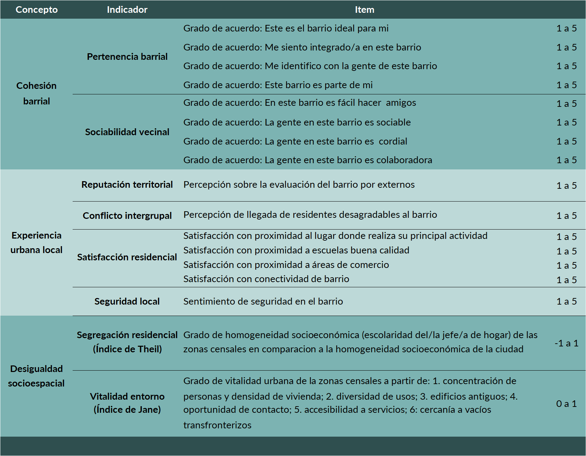
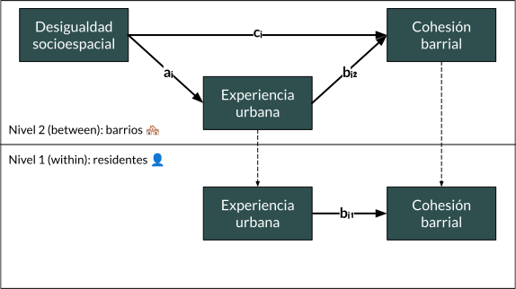
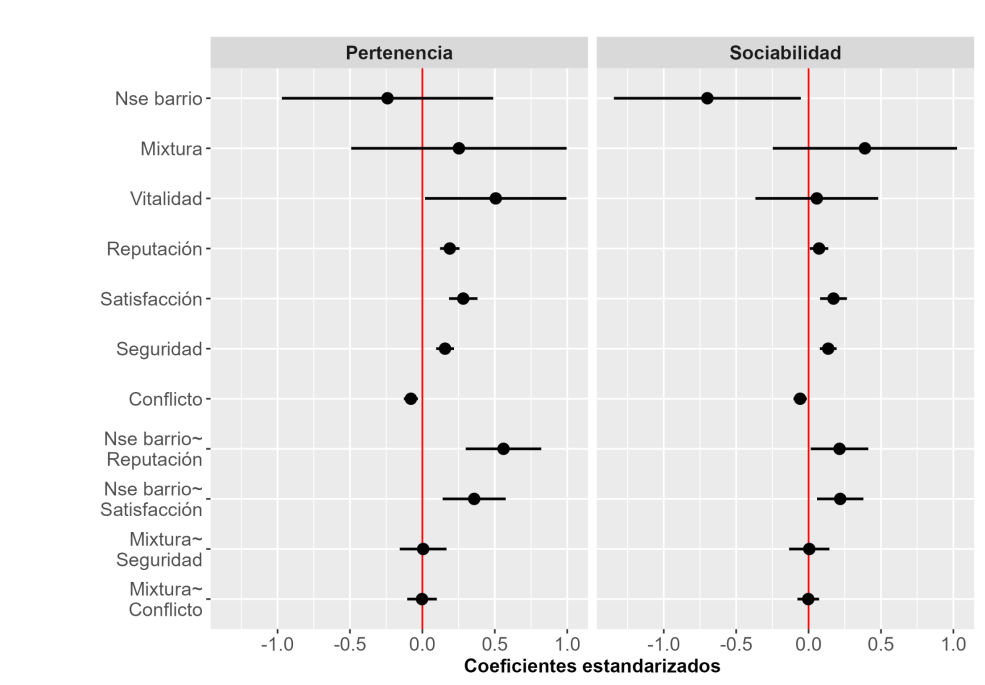
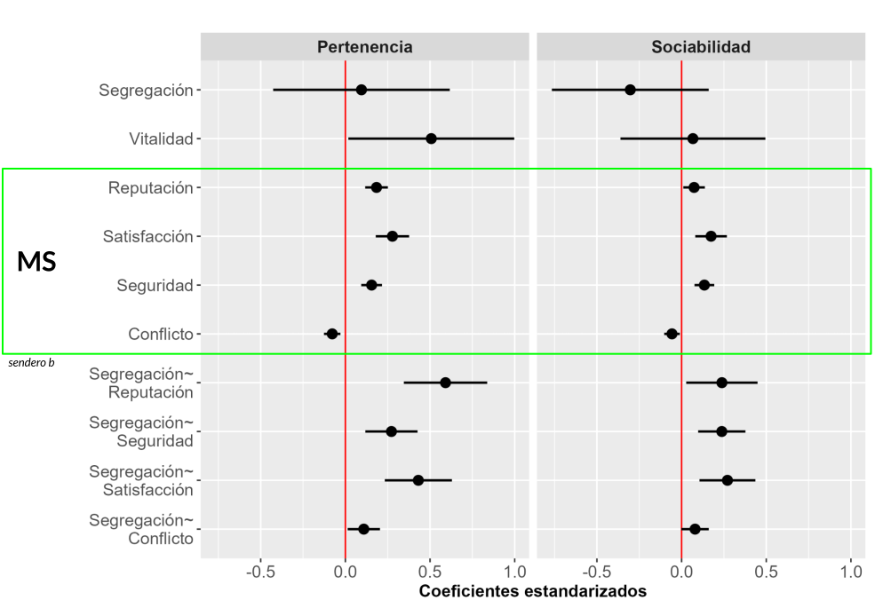
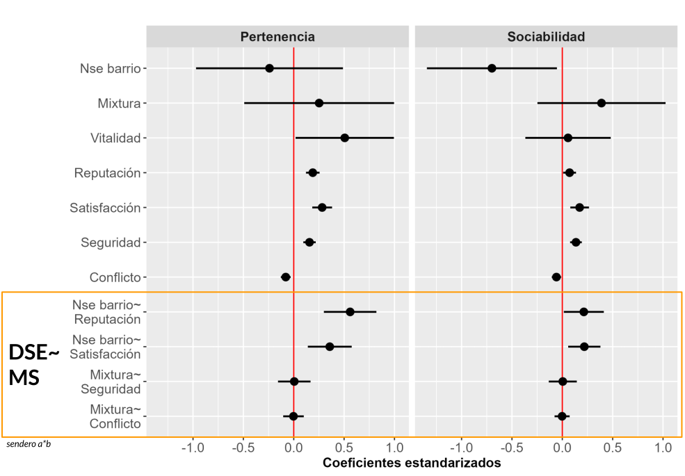

```{r setup_theme, include = FALSE}

library(xaringanthemer)
style_duo(
  primary_color = "white",
  secondary_color = "#2F4F4F",
  text_color = "#2F4F4F",
#  base_color = '#1068E9',
#  background_color = 'white',
  background_position = 'center',
  header_font_google = google_font("Lato"),
  text_font_google   = google_font("Lato", "300", "300i"),
  code_font_google   = google_font("Droid Mono"),
  code_font_size = '60%',
  #padding= "1em 4em 1em 4em",
  padding = "0.4em 2.4em 0.4em 2.4em",
  extra_fonts = list(google_font("Lato")),
  extra_css = 
  list(
  ".red"   = list(color = "red"),
  ".small" = list("font-size" = "90%"),
  ".pull_l_70" = list("float" = "left","width" = "72%", "font-size" = "90%"),
  ".pull_r_30" = list("float" = "right","width" = "23%"),
  ".pull_left"  = list("float" = "left","width" = "47%", "height" = "100%", "padding-right" = "2%"),
  ".pull_right" = list("float" = "right","width" = "47%", "height" = "100%", "padding-left" = "2%"),
  ".small_left"  = list("float" = "left", "width" = "47%", "height" = "50%", "padding-right" = "2%"),
  ".small_right" = list("float" = "right","width" = "47%", "height" = "50%", "padding-left"  = "2%"),
  ".left_code" = list("float" = "left",  "width" = "47%", "height" = "100%", "padding-right" = "2%",
    "font" = "Hack"),
  ".code_out"  = list("float" = "right", "width" = "47%", "height" = "100%", "padding-left"  = "2%",
    "font" = "Hack"),
  ".text_180" = list("font-size" = "180%"),
  ".text_170" = list("font-size" = "170%"),
  ".text_160" = list("font-size" = "160%"),    
  ".text_150" = list("font-size" = "150%"),
  ".text_140" = list("font-size" = "140%"),  
  ".text_130" = list("font-size" = "130%"),
  ".text_120" = list("font-size" = "120%"),
  ".text_110" = list("font-size" = "110%"),
  ".text_110" = list("font-size" = "110%"),
  ".text_100" = list("font-size" = "100%"),
  ".text_90" = list("font-size" = "90%"),
  ".text_80" = list("font-size" = "80%"),
  ".text_70" = list("font-size" = "70%"),
  ".text_60" = list("font-size" = "60%"),
  ".text_50" = list("font-size" = "50%"),
  ".text_40" = list("font-size" = "40%"),
  ".text_30" = list("font-size" = "30%"),
  ".text_20" = list("font-size" = "20%"),
  ".line_space_11" = list("line-height" = "1.1em;"),
  ".line_space_09" = list("line-height" = "0.9em;"),
  ".line_space_07" = list("line-height" = "0.7em;"),
  ".line_space_05" = list("line-height" = "0.5em;"),
    ".tiny_text" = list(
      "font-family" = "Lato", 
      "font-size"= "70%"
      ),
    ".large_text" = list(
      "font-family" = "Lato", 
      "font-size"= "150%"
      ),
    ".slide_blue" = list(
      "background-color" = "#2F4F4F",
      "color" = "white"
      ),
  ".center_image" = list(
    margin  = "0",
    position = "absolute",
    top      = "50%",
    left     = "50%",
    '-ms-transform' = "translate(-50%, -50%)",
    transform = "translate(-50%, -50%)"
    )
  )
)


knitr::opts_chunk$set(comment = NA)
knitr::opts_chunk$set(dpi=2500)

knitr::opts_chunk$set(
	error = TRUE,
	message = FALSE,
	warning = FALSE,
	echo= TRUE
)
```

class: title-slide, inverse, middle, center

```{r echo=FALSE, out.width = '2%', out.height = '2%'}
knitr::include_graphics('./img/blank_space.png')
```

.line_space_07[
### Objective and subjective residential conditions 
### and their impacts on neighborhood cohesion in Santiago, Chile
]

<br>

.line_space_05[

.text_100[**Cristóbal Ortiz Vilches**] 

.text_100[Assistant Researcher L4 COES]

<br>

.text_100[**Quentin Ramond**]

.text_100[Adjunct Researcher L4 COES]

]

<br>

```{r echo=FALSE, out.width = '50%'}

```

---

class: middle

# Contenidos de la presentación: 

###  I. Introducción
### II. Estado del arte
### III. Método
### IV. Resultados
### V. Conclusión y discusión

---

class: inverse, center, middle

# I. Introducción

---

## Problema de investigación

#### La cuestión de la cohesión en una ciudad desigual:

  -  Cohesión social se ha vuelto una preocupación pública (Consejo de Cohesión Social, 2020)
  
    - Cohesión barrial como escala geográfica abordable (e.g. "Quiero Mi Barrio")
--

#### Principales tesis para el caso chileno (Gran Santiago): 

- El estado de la cohesión barrial de debe a los "efectos de barrio" en dos sentidos:

 - (1) Rol de la estructura social (segregación residencial)
 
 - (2) Rol de la estructura espacial (entorno construido)

???

(1) Segregación de grupos desfavorecidos ha "debilitado la noción de barrio" (Sabatini et al., 2013). En cambio para grupos favorecidos propicia la acumulación de cohesión barrial en tanto "forma de privilegio" (Méndez, et al. 2020). Rol de la estructura social

(2) Verticalización del centro y pericentro generan reconfiguraciones espaciales que dificultan prácticas de cohesión (Link, et al. 2021; Orellana, et al. 2022). Por el contrario, hay ciertas configuraciones espaciales (más vitales) que favorecen la cohesión barrial (Jacobs, 1961). Rol de la estructura espacial

--

#### Gran presencia de la pregunta por la relación entre *condiciones socioespaciales* y *cohesión barrial* en los últimos 10 años. Pero menos conocimiento sobre *cómo* estas condiciones afectan la cohesión

---

## Objetivo y pregunta

Ante este vacío, buscamos explicar la influencia de la desigualdad socioespacial mediante mecanismos subjetivos, es decir, a través de indicadores que expresen la experiencia en el barrio. **Rol de la estructura simbólica**

--

**¿Cómo influye la desigualdad socioespacial a través de las experiencias urbanas en el barrio en las formas de cohesión barrial de los residentes del Gran Santiago de Chile en 2022?**

```{r echo=FALSE, out.width = '65%', fig.align = 'center'}
knitr::include_graphics('./img/msem-seg-cob-con.svg')
```

---

class: inverse, center, middle

## II. Estado del arte

---

## Estado del arte: conceptos

.pull-left[
- **Cohesión barrial**: estado de la convivencia del colectivo residencial (Méndez et al., 2020; Schieffer & van der Noll, 2017), visible en tres disposiciones:
  - **Afectiva: apego barrial (pertenencia)**
  - **Relacional: relaciones vecinales (sociabilidad)**
  - Práctica: compromiso cívico local (participación)
]

.pull-right[
```{r echo=FALSE, out.width = '70%'}

```
]

--

.pull-left[
- **Desigualdad socioespacial**: la distribución diferenciada de esferas de interacción social y de acceso recursos, así como en la internalización de estas diferencias (PNUD, 2017; Kaztman, 2010). En suma, tres estructuras:
 - **Social: segregación residencial (homogeneidad)**
 - **Espacial: entorno construido (vitalidad)**
 - **Simbólica: experiencia (subjetividad)**
]

.pull-right[
```{r echo=FALSE, out.width = '70%'}

```
]

---

## Estado del arte: teoría

--

1. **Hipótesis de contacto y amenaza (efecto de la composición social/segregación)**

  - a favor: ⬆️ segregación → ⬇️ cohesión (Sabatini et al. 2013)
  - en contra: ⬆️ segregación → ⬆️ cohesión (Putnam, 2007)
  - salvedad: ⬆️ segregación → ⬆️ó⬇️ cohesión (Méndez et al. 2020)

--

2. **Geografías del encuentro (efecto del espacio/entorno construido)**

  - vitalidad urbana: ⬆️ mixtura de usos → ⬆️ cohesión "práctica" (Jacobs, 1967)
  - familiaridad pública: ⬆️ espacios públicos → ⬆️ cohesión "simbólica" (Blokland & Nast, 2014)
  - salvedades: ⬆️⬆️densidad/mixtura usos → ⬇️ cohesión (Link, et al. 2022)

--

3. **Mecanismos subjetivos (efecto de las percepciones y creencias)**

  - reputación territorial: ⬇️ reputación → ⬇️ cohesión (Alvarez & Ruiz-Tagle, 2022; Otero et al. 2023)
  - sentimiento de seguridad: ⬇️ seguridad → ⬇️ cohesión (Dammert, 2004; Luneke, 2016)
  - satisfacción residencial: ⬆️ satisfacción → ⬆️ cohesión (Bonaiuto et al., 2017)
  - percepción de diversidad: ⬆️ conflicto → ⬇️ cohesión (Koopmans & Schaeffer, 2015)
  
---

## Hipótesis

.pull-left[
1. **Homogeneidad residencial (Hipótesis de Amenaza)**

  - H1c: Homogeneidad ⬆️ → Cohesión ⬆️
	- H1ab: Homo. ⬆️ → Mecanismo ⬆️ → Cohesión ⬆️

2. **Vitalidad entorno (Geografías del Encuentro)**

  - H2c: Vitalidad ⬆️ → Cohesión ⬆️
	- H2ab: Vita. ⬆️ → Mecanismos⬆️ → Cohesión ⬆️

3. **Experiencia urbana (Mecanismos subjetivos)** 

	- H3b: Mecanismo ⬆️ → Cohesión ⬆️
]

.pull-right[
```{r echo=FALSE, out.width = '100%', fig.align = 'center'}

```
]

---

class: inverse, center, middle

## III. Método

---

## Datos y caso de estudio

.pull-left[
Datos
 - Variables actitudinales/subjetivas (ELSOC, 2022)
 - Variables territoriales/objetivas (CENSO, 2017; OCUC, 2017)

Unidades de análisis en dos niveles:
  - Residentes👤: habitantes urbanos de nacionalidad chilena residentes del AMS de entre 18 y 75 años (720 casos).  
  - Barrio🏘: zonas censales del AMS que anidan unidades de análisis individuales (186 casos).
]

.pull-right[
```{r echo=FALSE, out.width = '80%'}

```
]

---

## Variables

```{r echo=FALSE, out.width = '65%', fig.align = 'center'}

```

???

Theil: grado de diversidad socioeconómica (años de escolaridad) en entornos locales (zonas censales) con respecto a un entorno general (Gran Santiago). Así, el índice H varía de manera continua entre 0 y 1, siendo: (0) zona más heterogénea, donde la diversidad socioeconómica local es igual a la general del GS y (1) zona completamente homogénea, donde existe un solo nivel socioeconómico

---

## Procedimiento analítico

- Modelos de ecuaciones estructurales que incorporan factores objetivos y subjetivos en la explicación de la cohesión barrial
  - Análisis de efectos directos (DSE → COB): sendero 'c'
  - **Análisis de efectos indirectos  o mediados (DSE  →  EXP → COB): sendero 'a' y 'b'**

- Recordando la pregunta de investigación

***¿Cómo influye la desigualdad socioespacial a través de las experiencias urbanas en  la cohesión barrial?***

.pull-left[
```{r echo=FALSE, out.width = '100%'}

```
]

.pull-right[
- Mediación ocurre en el nivel 2 (varianza entre barrios). DSE→EXP(Intercepto)→COB(Intercepto). Es decir, un efecto de la DSE sobre las medias barriales del EXP y COB

- Supuesto: La DSE afecta a cada barrio en su conjunto (o, dicho de otra manera, DES afecta los EXP y la COB de sus residentes debido que habitan dicho barrio y no otro)
]

---

class: inverse, center, middle

## IV. Resultados

---

class: inverse, center, middle

## IV.1 Resultados explicativos: los efectos subjetivados

---

## Los efectos subjetivados

```{r echo=FALSE, out.width = '70%', fig.align = 'center'}

```

---


## Los efectos subjetivados (H1 & H2)

```{r echo=FALSE, out.width = '70%', fig.align = 'center'}
knitr::include_graphics('./img/coef-plot-2.svg')
```

---

## Los efectos subjetivados (H3)

```{r echo=FALSE, out.width = '70%', fig.align = 'center'}

```

---

## Los efectos subjetivados (H1i & H2i)

```{r echo=FALSE, out.width = '70%', fig.align = 'center'}

```

---

class: inverse, center, middle

## V. Conclusión 

---

## Discusión

#### 1. La desigualadad socioespacial NO explica los niveles de cohesión barrial por sí sola, sino sólo a través de la experiencia que permiten interiorizar estas diferencias. Del *efecto de barrio* al *efecto subjetivado*

--

- ~~H1c: Homogeneidad ⬆️ → Cohesión ⬇️~~ 
  - **H1ab: Homogeneidad ⬆️ → Reputación ⬇️ → Cohesión ⬇️**  

- ~~H2c: Vitalidad ⬆️ → Cohesión ⬆️~~ 
  - **H2ab: Vitalidad ⬆️ → Seguridad ⬇️ → Cohesión ⬇️**  

- **H3: Reputación/satisfacción/seguridad ⬆️ → Cohesión ⬆️**

--
	
Efecto subjetivado es una crítica y alternativa a los efectos de barrio (Ruiz-Tagle & López, 2014). Mecanismos no sólo con efecto mediador, sino efecto propio (Alvarez & Ruiz-Tagle, 2022; Otero et al. 2023)

Mayor peso de la estructura simbólica, la cuál internaliza mejor la estructura social (favorece hipótesis de contacto (Rasse, 2015; Sabatini et al., 2013)) que la espacial (crítica a las geografías del encuentro (Valentine, 2008))

???
  - **EXP** sugeridos por la literatura efectivamente favorecen la cohesión y tienen efecto propio, destacando la **REP**. Fundamento empírico para las críticas al efecto de barrio (Ruiz-Tagle & López, 2014). Subjetividad como expresión selectiva del entorno y muestra de la consolidación de estructuras simbólicas con capacidad para deteriorar o fortalecer la cohesión

---

## Contribución

1. **Con los *efectos subjetivados* identificamos un mecanismo explicativo para un tema cada vez más relevante para la política territorial chilena**

  - Políticas de integración territorial deben considerar la reputación territorial y la seguridad ciudadana, que si bien dependen en parte de las condiciones socioespaciales, van más allá de ella.

--

2. **Los *efectos subjetivados* operan en grupos bajos y medios, en cambio grupos altos pueden prescindir de ellos en virtud de su posición ventajosa**

 - Grupos bajos y medios dependen de la reputación, satisfacción y seguridad para cohesionarse, grupos altos en mucha menor medida
  
---

class: inverse, center, middle

# Gracias por su atención!
## Conversemos 😄
## cristobalortizvi@gmail.com 📧

---

class: inverse, center, middle

## VII. Anexos

---

## Caracterización NSE

NSE alto (N=50); NSE medio (N=235); NSE bajo (N=319)

```{r echo=FALSE, out.width = '60%', fig.align = 'center'}
knitr::include_graphics('./img/caract-nse.svg')
```

---

## Desigualdad socioespacial y cohesión barrial 

```{r echo=FALSE, out.width = '60%', fig.align = 'center'}
knitr::include_graphics('./img/boxplot-dse-cob.svg')
```
