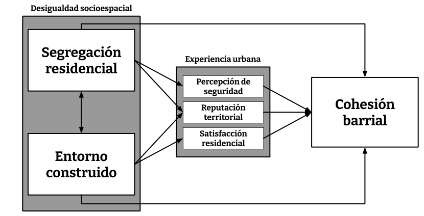
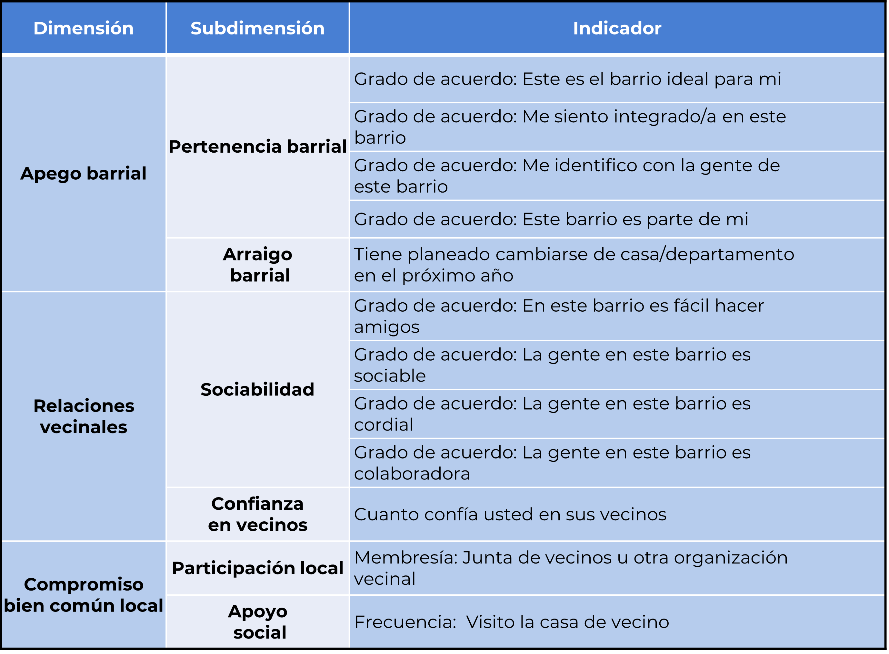
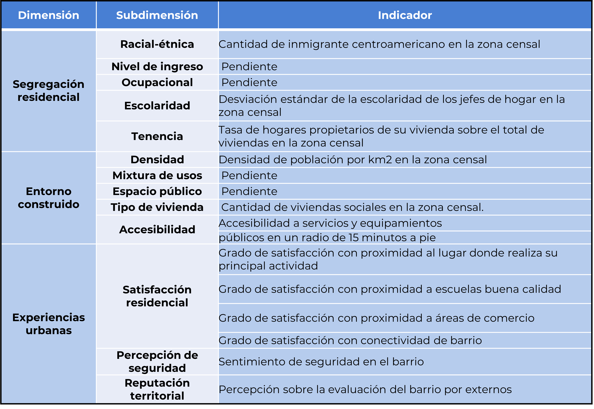

```{r setup, include=FALSE}
options(htmltools.dir.version = FALSE)
knitr::opts_chunk$set(
  fig.width=9, fig.height=3.5, fig.retina=3,
  out.width = "100%",
  cache = FALSE,
  echo = TRUE,
  message = FALSE, 
  warning = FALSE,
  hiline = TRUE
)
names(xaringan:::list_css())
```

```{r librerias-dataset, include=FALSE}
load("../1_input/data/procesada/elsoc.RData")
library(tidyverse)
library(broom)
library(texreg)
```

class: middle

# Contenidos de la presentación: 

###  I. Problema de investigación
### II. Estado del arte, vacío y pregunta
### III. Método

---

class: inverse, center, middle

# I. Problema de investigación

---

## Problema de investigación

--

### A. Gran Santiago como ciudad segregada y diversa:

--

  -  Cohesión social se ha vuelto una preocupación pública (Consejo de Cohesión Social, 2020)
    - Cohesión barrial como escala geográfica abordable (incluso desde antes del Consejo)
--

### B. Principales tesis para el caso chileno (Gran Santiago): 

--

- Deterioro de la cohesión barrial se debe a "efectos de barrio" en tres sentidos:

--

  - (1) Segregación de la vivienda social (familiar empobrecidas) en periferias excluidas geneneró una serie de dinámicas que terminaron por debilitar la "noción de barrio" (Sabatini et al., 2013). 

--

  - (2) Verticalización del centro y pericentro causan reconfiguraciones espaciales que dificultan prácticas de cohesión (Link, et al. 2021; Orellana, et al. 2022).

--

  - (3) Desigualdades socioespaciales favorecen "acumulación" de la cohesión barrial (Méndez, et al. 2020).

--

### Pregunta por la relación entre la desigualdad socioespacial y las formas de cohesión barrial

---

class: inverse, center, middle

## II. Estado del arte, vacío y pregunta

---
## A. Estado del arte: conceptos

**Concepto de cohesión social**

  - Definición analítica (no normativa) y multidimensional: “atributo descriptivo de un colectivo, que indica la calidad de la unión colectiva” Y que se caracteriza en lo esencial por tres componentes “*una fuerte conexión emocional con la entidad social*, *estrechas relaciones sociales*, y una *fuerte orientación hacia el bien común*” (Schieffer & van der Noll, 2017) 

--

**Concepto de cohesión barrial**

  - Estado de la convivencia del colectivo residencial, visible en la interrelación de actitudes y prácticas en torno a: el *apego al barrio*, las *relaciones de vecindad* y el *compromiso cívico local* (Méndez et al., 2020). En suma 3 dimensiones:
    - Afectiva
    - Relacional
    - Práctica

- Cada dimensión representa una forma diferente de cohesión, así como distintas funciones de lo que se considera un barrio en un mundo globalizado (Forrest, 2008). 

---
## A. Estado del arte: teoría

--

1. **Hipótesis del contacto (efecto de la segregación)**

  - a favor "heterofilia": (+) mixtura social (↓ segregación) $\to$ (+) cohesión (Sabatini et al. 2013)
  - en contra "homofilia": (+) mixtura social (↓ segregación) $\to$ (-) cohesión (Putnam, 2007)
  - salvedades: (+) segregación $\to$ (+-) cohesión; depende de la acumulación y prestigio (Méndez et al. 2020)

--

2. **Geografías del encuentro (efecto del entorno construido)**

  - vitalidad urbana: (+) mixtura de usos $\to$ (+) cohesión "práctica" (Jacobs, 1967)
  - familiaridad pública: (+) espacios públicos $\to$ (+) cohesión "simbólica" (Blokland & Nast, 2014)
  - salvedades: (+) densidad/mixtura usos $\to$ (-) cohesión (Link, et al. 2022)

--

3. **Mecanismos cognitivos (efecto de experiencias de malestar)**

  - reputación territorial: (-) reputación $\to$ (-) cohesión (Wacquant et al., 2014; (Alvarez & Ruiz-Tagle, 2022)
  - sentimiento de seguridad: (-) seguridad $\to$ cohesión (Dammert, 2004; Luneke, 2016)
  - satisfacción residencial: (+) satisfacción $\to$ (+) cohesión (Ramkissoon & Mavondo, 2015)

---
## B. Vacíos investigativos

--

1. **Pocas mediciones conjuntas y multidimensionales de los determinantes de la cohesión barrial**

  - ¿Es más determinante la composición social o espacial?, ¿sobre cuál forma de cohesión?
  - ¿Qué dimensión de la segregación influye cuál forma de la cohesión barrial?

--

2. **Predominio de explicaciones estructurales infravaloran el rol de los mecanismos cognitivos**

  - Ignora la **vivencia y significación** del espacio urbano, la **experiencia** de habitar el barrio
  - Una cosa es que en barrios segregados existan problemas, otra es que la segregación efectivamente contribuya a causarlos.
  
---
## C. Pregunta: 
***¿Cómo ha influido la segregación residencial y la calidad del entorno construido, a través de diferentes experiencias urbanas, en las formas de cohesión barrial percibida por los residentes de Santiago de Chile entre 2018 y 2022?***



---

class: inverse, center, middle

# III. Método


---
## Datos y caso de estudio

.pull-left[
- Muestra ELSOC es probabilística, estratificada y por conglomerados, incluye un total de 2927 casos representativos a nivel nacional -> **Representativa para el AMS**.
- Unidades de análisis en dos niveles:
  - individual: habitantes urbanos de nacionalidad chilena residentes del AMS de entre 18 y 75 años (720 casos).  
  - barrial: zonas censales del AMS que anidan unidades de análisis individuales (186 casos).
]

--
.pull-right[
- **¿Por qué el Gran Santiago?**
  - Gran número de estudios sobre el GS: permite comparabilidad, gracias a esto, un cierto control por diseño.
  - IPT del GS son dispares (PRC), pero intentos constantes de unificarlo normativamente (PRIS y PRMS).
  - Forma urbis del GS como combinación única de modernidad y subdesarrollo, la vuelve ideal para el estudio de las desigualdades y su efecto en la vida de las personas.
]

---
## Operacionalización



---

## Operacionalización




---
## Procedimiento analítico

- Modelos de ecuaciones estructurales multinivel que incorporan factores cognitivos y concretos en la explicación de la cohesión.
  - Análisis de efectos directos de la segregación y el entorno
  - Análisis de efectos de mediación de experiencias (mecanismos cognitivos)
  - Análisis de efectos de moderación de la segregación sobre la relación entre entorno y cohesión (y viceversa)

- Clusterización de relaciones entre variables más significativas
  - Permite situar geográficamente barrios según las condiciones socioespaciales que favorecen determinada forma de la cohesión.

---

class: inverse, center, middle

# Gracias por su atención!
## Conversemos 😄
**cristobalortizvi@gmail.com 📧**

