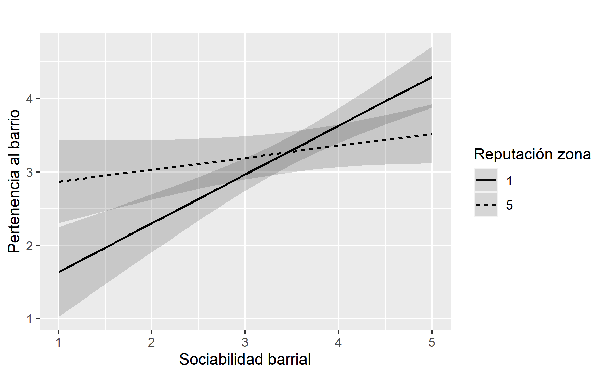
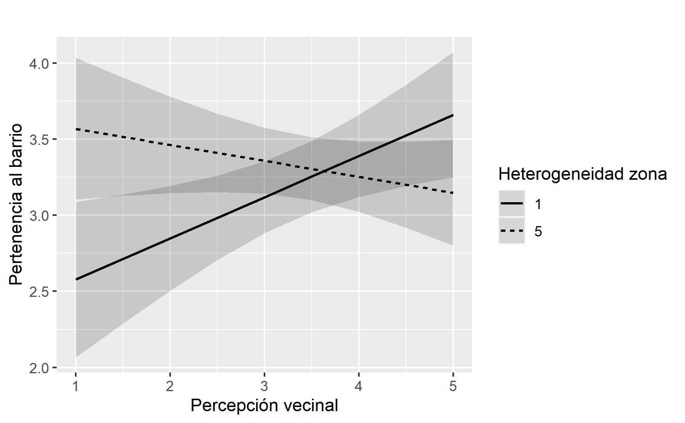

```{r setup, include=FALSE}
options(htmltools.dir.version = FALSE)
knitr::opts_chunk$set(
  fig.width=9, fig.height=3.5, fig.retina=3,
  out.width = "100%",
  cache = FALSE,
  echo = TRUE,
  message = FALSE, 
  warning = FALSE,
  hiline = TRUE
)
names(xaringan:::list_css())
```

```{r librerias-dataset, include=FALSE}
load("../1_input/data/procesada/elsoc.RData")
library(tidyverse)
library(broom)
library(texreg)
```

class: middle

# Contenidos de la presentación: 

###  I. Problema de investigación
### II. Teoría e hipótesis
### III. Método
### V. Resultados
### VI. Discusión

---

class: inverse, center, middle

# II. Problema de investigación

---

## Problema de investigación

--

### A. AMS ciudad fragmentada y desigual:

--

  -  Problemas de cohesión social a escala barrio.
    - Problemas de pertenencia barrial
    
--

### B. Hipótesis principal (ecológica): 

--

#### Segregación residencial a gran escala desencadena mecanismos que pueden causar _desintegración social_ y _desapego territorial_  (Sabatini et al. 2001; 2010).

--

  > Esfera política: detras de políticas públicas de mixtura socio-espacial.

--

  > Esfera científica: cohesión (y pertenencia) depende en último término de dinámicas socio-espaciales mayores (**efecto barrio**).

--
  
### ¿Por qué esta explicación resulta insuficiente?
  
---

class: middle right inverse
background-image: url('gse-ams.png')
background-size: 550px
background-position: 10% 50%

--

### Segregación clase baja ~ 
### (-) k social ~ (-) pertenencia

--

### Segregación clase alta ~ 
### (+) k social ~ (+) pertenencia

--

### PERO, hipótesis ecológica... 

--

#### ... oculta mecanismos explicativos que generan <br> los problemas sociales (Ruiz-Tagle & López, 2014)

--

#### ... ignora la vivencia y significación del espacio urbano <br> (Jirón et al. 2010)

--

### **¿Siempre ocurre así?** 

---

class: inverse, center, middle

## III. Teoría e hipótesis

---

## Antecedentes empíricos: ¿bajo qué condiciones surge la pertenencia?

####  1. Hipótesis principal:

--

- Segregación residencial $\to$ pertenencia barrial (Sabatini et al. 2001; 2010)
  - Segregación residencial $\to$ k social/sociabilidad ~ pertenencia barrial 

--

#### 2. Más allá de la hipótesis pricipal: 

--

- Densidad poblacional $\to$ pertenencia barrial (Méndez et al., 2017; Señoret & Link, 2019)
  - Densidad poblacional $\to$ sociabilidad ~ pertenencia barrial
- Accesibilidad urbana $\to$ pertenencia barrial (Sabatini y Wormald, 2013)
  - Accesibilidad urbana $\to$ satisfacción residencial ~ pertenencia barrial
- Estigma territorial $\to$ pertenencia barrial (Wacquant et al., 2014)
  - Estigma territorial $\to$ sociabilidad/percepción ± vecinal ~ pertenencia barrial

--

#### 3. Problemas

--

- Oculta **mecanismos explicativos** que generan los problemas sociales (Ruiz-Tagle & López, 2014)
- Ignora la **vivencia y significación** del espacio urbano (Jirón et al. 2010)
- No siempre evalúa ni mide el **rol del espacio**, lo da por sentado (Galster, 2012)
  - una cosa es que en barrios segregados existan problemas, *otra es que la segregación efectivamente contribuya a causarlos*.
---

# Hipótesis

.center[]

--

> **H1 y H2 indican efectos directos positivos -> (+) $X_i$ $\to$ (+) $Y_i$ / (+) $Z_i$ $\to$ (+) $Y_i$**

> **H3 indica efecto moderador -> (+) $Z_i$ $\to$ (+) $X_i$ ~ $Y_i$**

---

class: inverse, center, middle

# IV. Método


---

# Datos y muestra

.pull-left[
- Nivel micro (actitudes, creencias y percepciones): datos trasversales de la primera ola de la encuesta ELSOC, correspondiente a una medición realizada el 2016.
- Nivel macro (atributos territoriales): datos transversales de CIT a escala zona (186) y distrito (168).
]

--
.pull-right[
- Muestra ELSOC es probabilística, estratificada y por conglomerados, incluye un total de 2927 casos representativos a nivel nacional -> **Representativa para el AMS**
- Seleccionamos 720 casos pertenecientes al AMS, ya que las unidades de análisis y observación son habitantes urbanos de nacionalidad chilena, residentes del AMS, de entre 18 y 75 años
]

---

# Variables

```{r echo=FALSE}
DT::datatable(openxlsx::read.xlsx("../variables.xlsx", sheet = 9), class = "hover",
              options = list(pageLength = 11))
```

---

# Procedimiento analítico:

### A. Modelo lineal jerárquico (HLM)

> (1) $Y_{ij}={\gamma_{00}+\mu_{0j}}+\ r_i$

> (2) $Y_{ij}=\gamma_{00}+\gamma_{i0}X_{ij}+\mu_{0j}+r_{ij}$

> (3) $Y_{ij}=\gamma_{00}+\gamma_{0i}Z_{ij}+\mu_{0j}+r_{ij}$

> (4) $Y_{ij}=\gamma_{00}+\gamma_{i0}X_{ij}+\gamma_{0i}Z_{ij}+\mu_{0j}+r_{ij}$

--

### B. Modelo de interacción entre niveles (CLIM)

> $Y_{ij}=\gamma_{00}+\gamma_{i0}X_{ij}+\gamma_{0i}Z_j+\gamma_{ij}X_{ij}Z_j+\mu_{0j}+\mu_{1j}X_{ij}+r_{ij}$

--

#### Donde $X_{ij}$ son factores de nivel micro-social anidados en el entorno j. Además, $Z_{ij}$ son factores de nivel macro-social del entorno territorial j.

---

class: inverse, center, middle

# V. Resultados

---

#  Resultados: H1 y H2

```{css, echo = F}
table {
  font-size: 12px;     
}
```

```{r echo = FALSE}
DT::datatable(openxlsx::read.xlsx("../3_output/tablas/cap2/tablas_cap2.xlsx", sheet = 3), 
              colnames = c('Dimensión', 'Variable','Modelo\nNulo', 'Modelo\nIndividual', 'Modelo\nTerritorial', 'Modelo\nMultinivel'),
              class = "hover",
              options = list(pageLength = 13))
```

---

# Resultados H1: Modelo individual

1. Explica en buena medida la varianza de la pertenencia barrial -> $R^2ajustado = 0.48$ 

--

2. Los mejores factores explicativos son: **sociabilidad barrial** $\beta_{21} = 0.37$, **satisfacción residencial** $\beta_{31} = 0.24$, y la **reputación positiva** del barrio $\beta_{41} = 0.30$; en la dimensiones _social_ , _física_ y _simbólica_ del habitar respectivamente.

--

### <center> H1: (+) experiencia habitar $\to$ (+) pertenencia al barrio <center>

---

# Resultados H2: Modelos territorial y multinivel

1. Pertenencia al barrio es afectada por el entorno territorial

 - El 14.3% de la variabilidad de la pertenencia barrial se explica por las diferencias entre los entornos territoriales a escala zona. En cambio, este resultado baja a 11.8% en el caso de la escala distrito. La escala geográfica es importante para medir el tamaño de efecto del territorio sobre la pertenencia.

--

2. Los entornos territoriales de ***mixtura social***, con ***alta accesibilidad*** y ***prestigiosos*** afectan positivamente la pertenencia. Este efecto pierde significancia al introducir variables de nivel micro.

--

3.	A medida que el entorno territorial **aumenta la densidad poblacional**, la pertenencia se ve deteriorada. En presencia de variables de nivel micro, este es el único efecto que se mantiene significativo.

--

### <center> H2: (+) entorno territorial $\to$ (+) pertenencia al barrio <center>

---

#  Resultados H3: territorio $\to$ habitar ~ pertenencia

.pull-left[

]

.pull-right[

]

--

- Territorios con mayor reputación y heterogeneidad social pueden asegurar altos niveles de pertenencia al barrio, aún en ausencia de factores relevantes como la sociabilidad barrial y la percepción vecinal.

--

- La sociabilidad se vuelve irrelevante para explicar la pertenencia en territorios prestigiosos, en cambio, mejora su capacidad explicativa aquellos estigmatizados. Ocurre similar con percepción vecinal.

--

### <center> H3: (+) entorno territorial $\to$ (-) experiencia habitar ~ pertenencia al barrio <center>

---

class: inverse, center, middle

# VI. Discusión

---

# Discusión

### 1. pertenencia al barrio se explica, no tanto por los atributos del barrio en sí, sino por la experiencia de habitarlo.

--

  - personas pueden significar un mismo atributo de diferente manera, por lo tanto es **necesario incorporar la perspectiva del habitante para estudiar e intervenir lugares**.

--

  - atributos del barrio no dejan de ser importantes, pero ellos no son buenos para explicar directamente la pertenencia -> **¿efecto moderador?**

--

### 2. entorno territorial puede jugar un rol moderador relevante

--

  - territorios "integrados" y "prestigiosos" puede **asegurar pertenencia barrial**, aún en ausencia de factores relevantes como la **sociabilidad**.

--

  - territorios desiguales dan pie a **mecanismos de cohesión barrial diferentes**; ello invita a superar idea normativa de la cohesión (Méndez et al. 2020), por una noción de **formas de cohesión barrial**.

---

class: inverse, center, middle

# Gracias por su atención!
## Conversemos 😄
**cristobalortizvi@gmail.com 📧**

